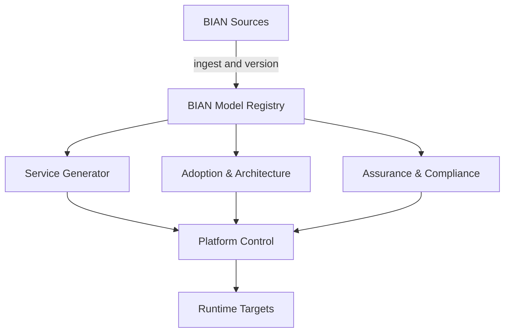

# Architecture Vision

## Document status

| Field | Value |
|---|---|
| Status | Draft for project-owner review |
| Architecture stage | Conceptual architecture |
| Lifecycle state | Concept |
| Scope | Full BIAN Adoption & Engineering Platform vision |
| Initial validation scenario | Horizon Synthetic Bank payments adoption, engineering, and assurance journey |
| Method | TOGAF-informed, tailored for a small open-source project |
| Last updated | 17 August 2026 |

This document establishes a shared direction for architecture work. It does not
approve a solution design, implementation technology, deployment topology, or
production-readiness claim.

## 1. Executive vision

The BIAN Adoption & Engineering Platform will use a canonical, versioned BIAN
Model Registry to drive service engineering, adoption and architecture, and
assurance and compliance capabilities from authorised BIAN sources.

The platform's central architectural idea is a trusted, versioned knowledge and
evidence foundation. It will distinguish what BIAN defines, what a bank states,
what the project derives, what an analytical capability infers, and what tests or
reviews have verified. Every material conclusion should be explainable through
its source, release, scope, method, confidence, review state, and limitations.

The platform connects with a bank's architecture repository, configuration
management database, API management platform, source-control system, developer
portal, control systems, delivery platforms, and runtime environments while
preserving their ownership and authority. It connects these concerns through the
shared BIAN Model Registry rather than recreating them as disconnected features.

## 2. Purpose of this architecture effort

This architecture effort will determine how the complete fourteen-use-case
vision can operate as one coherent product without prematurely building fourteen
separate products or selecting a technology stack.

It will:

- define the product boundary and its relationship with BIAN, bank systems,
  engineering platforms, governance processes, and external standards;
- identify the capabilities and information that must be shared across the
  product;
- make provenance, evidence, confidence, review, security, and change history
  architectural concerns rather than reporting additions;
- identify trust boundaries and accountable human decisions;
- define viewpoints that address real stakeholder concerns;
- use Horizon Synthetic Bank to test the architecture with repeatable scenarios;
- establish validation scenarios that exercise the complete platform structure;
- preserve optionality until solution decisions have evidence.

## 3. Opportunity and drivers

### Current problem

Banks commonly need to make architecture and transformation decisions across
fragmented application, API, integration, data, ownership, vendor, and control
records. BIAN can provide a common banking reference language, but the work of
relating that language to the bank's actual estate and maintaining it through
change remains difficult.

Point tools and periodic assessments can produce inventories, diagrams, API
contracts, or recommendations, but their conclusions often lose connection to
source evidence, accountable owners, implementation change, and later BIAN
releases.

### Strategic drivers

- make BIAN adoption actionable within an existing and imperfect bank estate;
- improve architecture decisions without overstating automated certainty;
- preserve knowledge and review decisions across programmes and releases;
- connect architecture governance to engineering delivery and operations;
- make security, control, and production-readiness claims evidence based;
- support bank deployment, integration, privacy, and resilience expectations;
- provide an open-source foundation that can be independently reviewed;
- use synthetic scenarios to progress without requesting customer data or trials.

## 4. Desired outcomes

The target architecture should enable a bank to:

1. understand the exact BIAN source and release being used;
2. map applications, APIs, integrations, data, ownership, and lifecycle to BIAN
   concepts without presenting a proposed mapping as BIAN fact;
3. explain alignment findings, uncertainty, duplication concerns, and gaps;
4. model current, transition, and target states around banking responsibilities;
5. connect transformation choices to dependencies, owners, risks, and evidence;
6. create governed engineering starting points without overwriting bank-owned
   implementation;
7. understand the impact of BIAN and bank-estate change;
8. apply context-specific security profiles and retain scoped control evidence;
9. govern new proposals using maintained knowledge rather than isolated review;
10. communicate adoption through multiple evidence-backed dimensions rather
    than a single opaque score.

These are product outcome hypotheses. Horizon Synthetic Bank can demonstrate
internal coherence and expected behaviour, but not customer demand, regulatory
acceptance, or realised bank value.

## 5. Stakeholders and concerns

The current project owner acts as sponsor and architecture authority during the
concept stage. Bank roles remain product personas until a real adopter exists.

| Stakeholder | Concern this architecture must address | Initial viewpoint |
|---|---|---|
| Project owner and sponsor | Coherent product direction, value, scope, risk, and sequencing | Motivation and roadmap |
| CIO and transformation sponsor | Portfolio outcomes, investment choices, dependencies, and measurable progress | Value, capability, and transition |
| CTO | Architectural integrity, evolution, integration, portability, and technology optionality | Context and architecture principles |
| CISO | Trust boundaries, identity, attack paths, evidence, and accountable risk decisions | Security and assurance |
| Enterprise and business architects | BIAN fidelity, mappings, scenarios, target states, and decision traceability | Capability, information, and scenario |
| API and platform teams | Discoverability, contracts, governed paths, reuse, and platform fit | Engineering enablement and integration |
| Risk and compliance | Requirement, control, test, evidence, exception, and attestation scope | Control and evidence |
| Application and service owners | Ownership, impact, migration, dependencies, and continuity | Landscape and impact |
| Data and integration owners | Data meaning, lineage, quality, interfaces, and reconciliation | Information and integration |
| Developers | Clear contracts, safe regeneration, feedback, and owned implementation boundaries | Engineering workflow |
| Operations and SRE | Reliability, observability, recovery, capacity, and supportability | Operational quality |
| Open-source maintainers | Reviewability, contributor safety, sustainability, release integrity, and support boundaries | Governance and delivery |
| BIAN-informed reviewer | Authoritative terminology, release fidelity, derivation, and non-affiliation | BIAN provenance |

Future architecture views must name the concern and stakeholder they serve.
Creating diagrams without a decision or concern is not an architecture outcome.

## 6. Scope

### Product breadth

The vision covers BIAN Sources, the BIAN Model Registry, Service Generator,
Adoption & Architecture, Assurance & Compliance, Platform Control, Runtime
Targets, and all fourteen use cases in the product catalogue. This prevents any
single pillar or validation scenario from becoming the definition of the whole
platform.

### Current depth

This iteration is conceptual. It covers purpose, capabilities, information,
actors, boundaries, trust, quality expectations, and major interactions. It does
not define service boundaries, APIs, schemas, data stores, runtime products,
cloud providers, Kubernetes resources, or source-code modules.

### Architecture domains

- **Business:** users, decisions, value flow, governance, ownership, and operating
  model.
- **Data:** information classes, provenance, identity, version, confidence,
  evidence, lineage, and retention concerns.
- **Application:** conceptual capabilities, interactions, external systems, and
  extension boundaries.
- **Technology:** quality attributes and deployment constraints only. Product and
  topology decisions are deferred.

### Time horizons

| Horizon | Purpose |
|---|---|
| Model foundation | Establish BIAN Sources, ingestion, versioning, provenance, and the canonical BIAN Model Registry |
| Pillar validation | Exercise Service Generator, Adoption & Architecture, and Assurance & Compliance through connected HSB scenarios |
| Platform control | Connect catalogue, templates, ownership, lifecycle, scorecards, documentation, policy, and workflow |
| Runtime readiness | Validate supported local, container, OpenShift, Kubernetes, cloud, and customer-controlled targets |

The horizons express dependency and learning, not delivery dates or a commitment
to build every capability.

### Explicitly outside this architecture vision

- detailed BIAN artefact ingestion or redistribution;
- implementation code and technology selection;
- production deployment or operational support;
- automated decisions that bypass accountable human review;
- replacement of existing bank systems of record;
- legal interpretation or regulatory attestation;
- a claim of BIAN, TOGAF, CNCF, Red Hat, or bank endorsement;
- validation of customer demand through HSB;
- a fixed commercial packaging or support model.

## 7. Baseline and target vision

### Baseline

The project is greenfield. Its baseline consists of a reviewed product
definition, governance rules, BIAN source and terminology policy, HSB validation
policy, open questions, and an archived technical spike with no architectural
authority.

The problem-domain baseline is fragmented knowledge:

- BIAN reference artefacts are separate from customer estate records;
- application, API, integration, data, ownership, and lifecycle views differ;
- architecture mappings and target-state decisions are often point-in-time;
- engineering outputs can become detached from architectural intent;
- control tests can be detached from requirements and claimed scope;
- recommendations and AI inferences can appear more authoritative than their
  evidence warrants.

### Target

The target is a maintained knowledge and decision environment in which BIAN
sources, bank assertions, mappings, architecture states, generated projections,
controls, evidence, and change decisions remain connected while retaining their
different authority and ownership.

The platform should support a continuous model-driven engineering and adoption
cycle:

```text
Authorised BIAN sources
        -> ingest, validate, and version
        -> BIAN Model Registry
        -> Service Generator
           + Adoption & Architecture
           + Assurance & Compliance
        -> Platform Control
        -> Runtime Targets and bank ecosystems
        -> evidence, decisions, and change feedback
        -> BIAN Model Registry
```

## 8. North-star platform structure

This is the authoritative vision-level structure of the product. The named
blocks are project concepts, not BIAN Service Domains or BIAN Business
Capabilities. They do not yet imply deployable service boundaries.



Intended BIAN source coverage includes the Service Landscape, Semantic APIs,
AsyncAPI definitions, Business Objects, Business Scenarios, Business
Capabilities, wireframes, and relevant ISO 20022 mappings where authoritative
sources and reviewed rights permit their use. This does not claim that every
artefact is currently available, licensed, or imported.

### Structure and use-case traceability

| Structure | Purpose | Primary catalogue traceability |
|---|---|---|
| BIAN Sources | Provide authoritative, rights-reviewed BIAN artefacts and relationships for declared releases | FDN-01 and all use cases |
| BIAN Model Registry | Maintain the canonical BIAN model, relationships, release versions, customer extensions and mappings, regulatory mappings, provenance, review, and evidence links | FDN-01 and all use cases |
| Service Generator | Produce REST and asynchronous API artefacts, models, SDKs, tests, infrastructure definitions, policies, documentation, and safe regeneration outputs | UC-01, UC-02, UC-03 |
| Adoption & Architecture | Support application and API mapping, capability views, Business Scenario overlays, current and target states, vendor analysis, modernisation, and roadmaps | UC-07, UC-08, UC-09, UC-10, UC-11, UC-12 |
| Assurance & Compliance | Apply security profiles and connect policies, requirements, controls, implementations, tests, evidence, attestations, exceptions, and scorecards | UC-04, UC-05, UC-14 |
| Platform Control | Provide catalogue, templates, ownership, lifecycle, architecture governance, scorecards, documentation, policy, and workflow across the three pillars | UC-06, UC-13 and cross-cutting support |
| Runtime Targets | Support approved local or Docker, OpenShift or Kubernetes, AWS, Azure, and customer-controlled environments | Cross-cutting delivery and operational concern |

Bank, HSB, regulatory, standards, vendor, and delivery-system information enters
through governed registry extensions and integrations. It never changes the
meaning of authoritative BIAN content. The three pillars reuse the registry and
must not create private copies of BIAN meaning, mappings, evidence, ownership,
or review decisions.

## 9. Information vision

The architecture is information-led. The trusted foundation is conceptually a
knowledge model, not a choice of graph, relational, document, or other storage.

The operational assertion classes in the BIAN alignment policy remain mandatory:

- Class A: authoritative BIAN assertion;
- Class B: mechanically derived BIAN projection;
- Class C: project extension;
- Class D: customer or fictional-bank assertion;
- Class E: inference or recommendation;
- Class F: third-party assertion.

The product vision's four classes of truth are a simpler user-facing grouping.
The conceptual information model must reconcile the two views explicitly rather
than allowing competing classifications. Evidence records should link a source,
requirement or assertion to a method, result, scope, time, version, reviewer, and
limitations. Evidence does not change an inference into BIAN fact.

Every material record or relationship will need an appropriate subset of:

- stable identity and namespace;
- assertion class and responsible owner;
- source owner, source location, source version, and source integrity;
- BIAN release and official identifier where applicable;
- effective time, recorded time, and change history;
- derivation method and tool version;
- confidence, rationale, and supporting evidence;
- review status, reviewer, and decision history;
- sensitivity, retention, access, and export classification;
- relationships to requirements, controls, tests, generated assets, and plans.

The conceptual information model is the next major architecture work product.
It must remain extensible without mirroring OpenAPI or a single BIAN publication
format as the platform's internal truth.

## 10. System context and external relationships

The platform will sit between authoritative and customer-controlled sources,
human decision-makers, analytical capabilities, and delivery ecosystems.

### Inbound relationships

- authorised BIAN repositories, packages, model services, or publications;
- bank architecture, application, API, integration, data, ownership, lifecycle,
  security, control, and delivery records;
- HSB synthetic equivalents of bank sources;
- standards, regulatory, vendor, and other third-party sources;
- human reviews, decisions, exceptions, and attestations.

### Outbound relationships

- reviewed landscape, alignment, scenario, target-state, roadmap, and scorecard
  views;
- governed findings, decisions, actions, and evidence packs;
- model-derived APIs, events, schemas, tests, SDKs, policies, catalogue metadata,
  or deployment assets where later approved;
- integrations with architecture repositories, API platforms, CMDBs,
  source-control, CI/CD, policy systems, observability, and developer portals;
- portable exports that preserve provenance and prevent platform lock-in.

Platform Control is part of the product vision. Red Hat Developer Hub is the
intended future front door for catalogue, templates, ownership, lifecycle,
scorecards, and documentation, subject to later solution validation. It is not
the system of record and does not replace or determine the BIAN Model Registry.

## 11. Trust boundaries

| Boundary | Primary concern | Required architectural response |
|---|---|---|
| BIAN and external-source intake | Authenticity, rights, integrity, ambiguity, and malicious content | Allowlisting, integrity verification, source register, validation, quarantine, and lineage |
| Bank or HSB intake | Sensitivity, quality, ownership, conflicting identifiers, and stale records | Classification, access control, reconciliation, data-quality state, and accountable ownership |
| Analysis and inference | False confidence, model error, manipulation, and unexplained recommendations | Evidence, method version, uncertainty, review workflow, repeatability, and no automatic promotion to fact |
| Human authority | Unclear accountability, unsafe approval, and non-repudiation | Named roles, separation of duties, recorded decisions, scoped permissions, and audit history |
| Extensions and generated artefacts | Unsafe execution, dependency risk, tampering, and ownership confusion | Sandboxing or isolation, signed provenance, policy gates, disposable output, and explicit owned boundaries |
| External tools and delivery systems | Excess privilege, data leakage, drift, and partial failure | Least privilege, governed contracts, secure identity, failure handling, observability, and reconciliation |
| Tenant and deployment environment | Cross-tenant exposure, residency, encryption, recovery, and operator access | Explicit tenancy model, isolation, customer-controlled policy, audit export, backup, restore, and exit |
| Open-source build and release | Compromised contributors, dependencies, workflows, or artefacts | Protected review, pinned dependencies, SBOM, signing, reproducible evidence, and security response |

Detailed threat models and data-flow diagrams follow after conceptual boundaries
and sensitive information flows are agreed.

## 12. Architecture principles applied to the vision

1. **BIAN authority is preserved.** Only authoritative, rights-reviewed BIAN
   content is represented as BIAN. The R14 distinction between 258 Service
   Domains and 242 published API specifications remains explicit, and the
   platform never invents BIAN Service Operations for the remaining domains.
2. **Provenance is part of meaning.** A material assertion without adequate
   origin, version, method, and ownership is incomplete.
3. **Evidence precedes claims.** Security, compliance, alignment, production
   readiness, and modernisation statements remain scoped to evidence.
4. **Human accountability is explicit.** Automation and AI can propose or
   verify within scope; accountable people approve material bank decisions.
5. **One shared knowledge foundation.** Capabilities reuse governed identity,
   relationships, history, and evidence rather than create hidden truth stores.
6. **Generated and owned assets remain separate.** Regeneration never silently
   overwrites bank-owned logic, adapters, decisions, or configuration.
7. **Extensions attach through governed seams.** Security profiles, regulations,
   customer models, plugins, and delivery tools do not alter authoritative BIAN
   semantics.
8. **Cloud-native qualities follow CNCF guidance.** Loose coupling, security,
   resilience, manageability, sustainability, observability, and repeatability
   drive decisions; microservices and Kubernetes are not assumed answers.
9. **The core remains portable.** Bank-controlled, self-managed, restricted
   network, Kubernetes, and OpenShift contexts remain possible until requirements
   justify narrower support.
10. **Open source must be operable and governable.** Review, source rights,
    security response, reproducibility, support scope, and lifecycle are product
    concerns.
11. **Synthetic evidence is labelled honestly.** HSB supports repeatability, not
    claims of real-bank demand, value, or regulatory acceptance.
12. **Complexity must earn its place.** Components, services, dependencies, and
    abstractions require a named outcome, quality attribute, or trust boundary.

## 13. Initial validation scenario

The initial scenario is a bounded HSB payments journey that exercises adoption,
engineering, and assurance through the shared BIAN Model Registry. It is a
validation device, not the centre of the product and not a commitment that
payments or assessment tooling will be the first commercial offer.

The scenario should answer a connected set of questions:

- Which authoritative BIAN sources and relationships define the selected scope?
- Where are those responsibilities implemented across HSB, and how trustworthy
  are the mappings and target-state decisions?
- Which contracts, models, tests, and scaffolds can be projected from the same
  governed model without overwriting owned implementation?
- Which security requirements and controls apply, what evidence exists, and what
  remains explicitly unverified?
- How will Platform Control expose ownership, lifecycle, governance, workflow,
  documentation, and scorecards across the journey?
- What must be true for the outputs to operate safely in selected Runtime Targets?

The adoption part exercises focused elements of UC-07, UC-08, UC-09, UC-10,
UC-11, UC-13, and UC-14. Connected scenario stages will then use the same model
elements to exercise Service Generator capabilities in UC-01, UC-02, and UC-03,
Assurance & Compliance capabilities in UC-04 and UC-05, Platform Control in
UC-06, and vendor analysis in UC-12.

Expected architecture learning includes:

- which BIAN sources and relationships are actually required;
- which bank and HSB information concepts must be represented;
- how mappings, uncertainty, review, and disputes behave;
- how current, transition, and target assertions differ;
- how generated projections retain source and release lineage;
- how security profiles, controls, tests, evidence, and gaps stay connected;
- how Platform Control governs the three pillars without replacing the registry;
- which Runtime Target requirements materially affect the model and outputs;
- which evidence makes findings credible to architects and owners;
- which integration boundaries are essential and which can be deferred;
- where tenant, identity, privacy, and audit concerns arise;
- what information must remain reusable by later use cases.

## 14. Success measures and evidence

### Architecture-stage acceptance

- all fourteen use cases trace to the capability vision;
- named stakeholder concerns have planned viewpoints;
- BIAN, bank, project, inference, external, and evidence authority remain distinct;
- scope, exclusions, assumptions, risks, and trust boundaries are explicit;
- connected HSB scenarios can test the BIAN Model Registry and all three pillars;
- no solution technology is presented as an approved architecture decision;
- open questions are routed to future work rather than hidden.

### Future product evidence hypotheses

- every BIAN-attributed assertion can reproduce its authorised source and release;
- every derived output can identify its source elements and derivation version;
- every inference can show rationale, evidence, uncertainty, and review state;
- every material architecture finding can identify affected assets and owners;
- every generated asset can identify its inputs and remain separate from owned
  implementation;
- every assurance statement can identify requirement, control, implementation,
  test, evidence, scope, time, version, gaps, and reviewer;
- HSB scenarios produce repeatable expected results, including ambiguity,
  contradiction, adversarial input, and failure cases.

Measures of customer demand, adoption cost, realised value, and operating-model
fit remain unvalidated until supported by evidence beyond HSB.

Architecture acceptance is not build authorisation. The product must also pass
the decision-value, connected-differentiation, input-feasibility, trust,
adoption-fit, sustainable-scope, and external-desirability tests in the
[value proposition and validation strategy](../product/VALUE_AND_VALIDATION.md).

## 15. Risks and responses

| Risk | Consequence | Architecture response |
|---|---|---|
| BIAN source rights or terminology are misunderstood | Invalid redistribution, misleading claims, or loss of trust | Source register, rights review, exact release provenance, and no invented semantics |
| The vision becomes fourteen disconnected products | Cost, duplication, and incoherent workflows | Shared BIAN Model Registry, three clear pillars, Platform Control, and connected validation scenarios |
| A shallow feature is added to every platform block | A broad demonstration that solves no user problem well enough to adopt | Validate one complete decision journey and deepen only the capabilities required by it |
| Mature adjacent tools are recreated | High delivery cost with weak differentiation and poor enterprise fit | Treat EA, API, GRC, generation, portal, and runtime products as systems to complement or integrate unless evidence justifies otherwise |
| The model becomes a copy of OpenAPI or one BIAN artefact | Later architecture and adoption uses become constrained | Extensible conceptual model based on identity, assertion, relationship, provenance, and evidence |
| Automated mapping appears authoritative | Unsafe decisions and rapid stakeholder distrust | Confidence, explanation, review, dispute, and explicit authority classes |
| HSB becomes unrealistically clean | Architecture passes tests that do not represent enterprise conditions | Contradictory, stale, incomplete, adversarial, and changing synthetic records |
| Security and assurance are treated as generated paperwork | Weak controls and inflated compliance claims | Threat-led design and regulation-to-evidence traceability with explicit gaps |
| Cloud-native becomes a product checklist | Premature distribution, operational complexity, or platform coupling | Trace decisions to current CNCF guidance and measurable requirements |
| Open-source ambition exceeds maintainer capacity | Unsafe releases, slow response, and abandoned scope | Narrow increments, explicit support status, automation, and sustainable governance |
| An experience or vendor layer dictates the core | Lock-in and distorted boundaries | Platform Control remains separate from the canonical BIAN Model Registry and uses governed integrations |
| Architecture documentation becomes the product | Slow learning and little validated value | Use each view to answer a decision and exercise it through HSB scenarios |

## 16. Assumptions and dependencies

### Assumptions

- connected HSB scenarios can create useful architecture learning before
  customer desirability is validated;
- authorised BIAN material will be available for the selected scope under terms
  compatible with the intended use;
- HSB can represent enough ambiguity and change to test enterprise concerns;
- human review remains acceptable for material mappings and recommendations;
- banks will prefer integration and export over replacement of established tools;
- architecture can preserve deployment optionality until requirements mature.

### Dependencies

- completion of the BIAN source-rights register for any artefact used;
- coherent HSB scenarios and expected outcomes spanning all three pillars;
- a conceptual information and provenance model;
- defined identity, tenancy, sensitivity, and evidence concepts;
- sustainable open-source licensing, contribution, and security governance;
- later review by people competent in BIAN, banking architecture, security,
  operations, accessibility, and open-source maintenance.

## 17. Required next viewpoints and work products

The value proposition and validation strategy remains a parallel investment
gate across every architecture work product. Architecture may describe the full
north-star, but implementation scope must remain bounded to evidenced value.

| Priority | Work product | Decision or concern answered |
|---|---|---|
| 1 | Architecture requirements register | What must the architecture achieve, for whom, and with what evidence? |
| 2 | Capability and value-flow view | How do the BIAN Model Registry, three pillars, Platform Control, and Runtime Targets create connected value? |
| 3 | Conceptual information and provenance model | What is known, who owns it, how does authority differ, and how does it change? |
| 4 | System context and ecosystem view | What is inside the platform and which external systems remain authoritative? |
| 5 | Trust-boundary and security view | Where can information, identity, code, inference, or authority cross risk boundaries? |
| 6 | Connected HSB scenario view | Can one model thread support adoption, engineering, assurance, control, and runtime concerns? |
| 7 | Operating-model and governance view | Who imports, reviews, approves, operates, supports, and changes the platform? |
| 8 | Conceptual component interaction view | Which responsibilities collaborate, without yet defining deployable services? |
| 9 | Architecture roadmap and transition view | What sequence reduces uncertainty and creates reusable value? |

ArchiMate may be used later where its notation materially improves a viewpoint.
No modelling language is mandated merely for visual consistency.

## 18. Decision requested from vision review

Review of this Architecture Vision should determine whether to:

1. accept the product boundary and target direction as the basis for conceptual
   architecture;
2. accept BIAN Sources, the BIAN Model Registry, the three product pillars,
   Platform Control, and Runtime Targets as the north-star structure;
3. accept the stakeholder, trust, evidence, BIAN, TOGAF, and CNCF positions;
4. identify material omissions, contradictions, or unacceptable assumptions;
5. authorise the next conceptual viewpoints and requirements work.

Acceptance would not approve implementation, a technology stack, commercial
claims, TOGAF conformance, or production use.

## References

### Internal

- [Product vision](../product/PRODUCT_VISION.md)
- [Value proposition and validation strategy](../product/VALUE_AND_VALIDATION.md)
- [Use-case catalogue](../product/USE_CASE_CATALOGUE.md)
- [End-to-end journeys](../product/END_TO_END_JOURNEYS.md)
- [Scope and prioritisation](../product/SCOPE_AND_PRIORITISATION.md)
- [BIAN alignment policy](../product/BIAN_ALIGNMENT_POLICY.md)
- [Fictional bank and synthetic validation](../product/FICTIONAL_BANK_AND_SYNTHETIC_VALIDATION.md)
- [Architecture and engineering principles](../governance/ARCHITECTURE_AND_ENGINEERING_PRINCIPLES.md)
- [Open-source and production readiness](../product/OPEN_SOURCE_AND_PRODUCTION_READINESS.md)

### Authoritative method and guidance

- [The TOGAF Standard, 10th Edition](https://www.opengroup.org/togaf)
- [TOGAF Standard licensing information](https://www.opengroup.org/togaf-standard-10th-edition-downloads)
- [CNCF Cloud Native Definition](https://github.com/cncf/toc/blob/main/DEFINITION.md)
- [CNCF TAG Security Cloud Native Security Whitepaper](https://tag-security.cncf.io/community/resources/security-whitepaper/)
