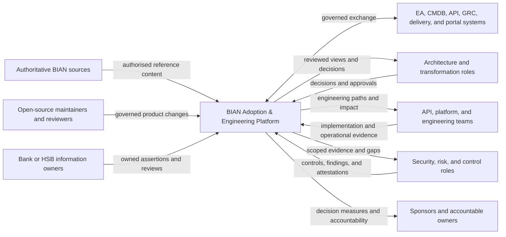
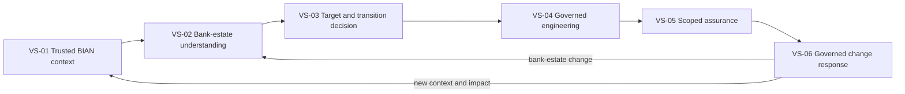

# Business Architecture

## Document status

| Field | Value |
|---|---|
| Status | Initial baseline for project-owner review |
| Architecture stage | Conceptual architecture |
| Architecture domain | Business Architecture |
| Scope | Full BIAN Adoption & Engineering Platform vision |
| Initial validation context | Horizon Synthetic Bank bounded payments decision journey |
| Method | TOGAF-informed and value-led |
| Last updated | 17 August 2026 |

This document defines how the platform is expected to create value, which
platform capabilities are required, who participates, and how decisions and
accountability should work. It does not approve implementation, organisation
design, product packaging, commercial demand, or solution technology.

## 1. Business Architecture proposition

The BIAN Adoption & Engineering Platform should help a bank turn authoritative
BIAN knowledge into reviewed architecture and engineering decisions that remain
connected to ownership, controls, evidence, and change.

Its value is not the presence of a model registry, generator, mapping tool,
control catalogue, portal, or deployment target in isolation. The business
proposition depends on preserving one decision thread across them:

```text
Authoritative BIAN context
        -> reviewed bank-estate understanding
        -> target and transition decision
        -> governed engineering action
        -> scoped assurance evidence
        -> ownership and change response
```

The accepted working architecture uses an enterprise or payments domain
architect as the primary user, a Chief Architect or Head of Enterprise
Architecture as sponsor, and a payments transformation sponsor as the funding
and sequencing role. Architecture enablement or BIAN stewardship represents the
operational owner. These roles are sufficient for HSB and conceptual
architecture; real-world buyer demand and operating fit remain unvalidated
under `EVD-001`.

## 2. Purpose and questions

This Business Architecture addresses:

- which stakeholder decisions the platform should improve;
- how stakeholder value is created from trigger to outcome;
- which platform capabilities enable that value;
- which business services the platform offers to its users;
- who supplies, reviews, approves, operates, and acts on information;
- where authority and accountability must remain human;
- how the product coexists with established bank systems and practices;
- what evidence would support or challenge the value proposition; and
- what should cause a proposition to stop or narrow.

Detailed information, application, technology, security, and solution designs
remain separate work products.

## 3. Method and terminology boundary

The structure is informed by TOGAF Business Architecture techniques, including
business capabilities, value streams, organisation mapping, information mapping,
and business scenarios. It is original project analysis and does not reproduce a
TOGAF template or claim TOGAF conformance.

BIAN and TOGAF have different roles:

- TOGAF guides the architecture method and viewpoints;
- BIAN provides authoritative banking reference content and taxonomy within
  reviewed source rights; and
- the project defines how this independent platform creates and governs value.

The following qualifiers are mandatory in this document and future views:

| Term | Meaning and authority |
|---|---|
| BIAN Business Capability | A capability attributed to BIAN only when reproduced from an authorised, release-qualified BIAN source |
| BIAN Service Domain | A BIAN-defined functional partition identified exactly from an authorised release |
| BIAN Business Scenario | A BIAN-defined scenario or project use of one, with the source and any project overlay distinguished |
| Platform capability | A project-defined ability required to operate the BIAN Adoption & Engineering Platform |
| Platform business service | A project-defined outcome or service offered by the platform to a consumer |
| HSB assertion | Fictional-bank content created for validation and never attributed to BIAN or a real bank |

The platform capability map below is not the BIAN Business Capability Model.
Similarity of wording does not imply a BIAN relationship.

## 4. Business ecosystem

The platform sits between authoritative reference content, bank-controlled
knowledge, accountable decision-makers, existing enterprise systems, and
delivery teams.



The platform does not become the system of record for every connected concern.
System-of-record ownership and reconciliation rules must be explicit for each
integration.

## 5. Baseline and target business state

### Baseline

The project is greenfield, but the problem it addresses has an existing business
state:

- BIAN reference content, bank-estate knowledge, architecture decisions,
  engineering assets, controls, and evidence are held in different places;
- mappings and architecture assessments are often point-in-time and costly to
  reconstruct;
- asset owners may not see how a BIAN-informed decision affects them;
- generated or templated engineering assets can lose connection to the target
  architecture and source model;
- assurance evidence can lose connection to the exact requirement, component,
  version, and assessed scope; and
- BIAN or bank change can trigger manual and incomplete impact analysis.

This baseline is a product hypothesis derived from current discovery. It is not
a measured statement about every bank.

### Target

The target business state is a federated, maintained decision environment in
which:

- authoritative BIAN context is stewarded once and reused consistently;
- bank assertions and mappings have accountable owners and review states;
- architects can move from current understanding to target and transition
  decisions without losing evidence or uncertainty;
- engineering and assurance actions remain traceable to approved context;
- established enterprise systems retain explicit ownership of their records;
- material change identifies affected decisions, assets, evidence, and owners;
  and
- measures show decision and stewardship outcomes rather than feature activity.

The transition starts with one bounded decision journey. It does not require a
bank-wide model or simultaneous adoption by every stakeholder group.

## 6. Stakeholder value propositions

| Stakeholder | Decision or job | Potential value | Evidence required |
|---|---|---|---|
| BIAN lead or enterprise architect | Establish how BIAN relates to the bank and maintain that understanding | Reviewed mappings, provenance, uncertainty, target-state context, and change impact in one maintained thread | Less reconstruction, actionable findings, accepted mappings, and independent review |
| Banking domain or solution architect | Allocate responsibilities and shape a change in context | Current, target, scenario, dependency, and ownership views grounded in reviewed evidence | A design decision changes or reaches review with fewer unresolved questions |
| Transformation sponsor | Select and sequence modernisation actions | Traceable options, dependencies, retained responsibilities, risks, and transition decisions | A roadmap decision becomes more defensible and affected owners are visible |
| API and platform team | Reuse or create a governed service starting point | Discoverable responsibilities, existing assets, approved projections, profiles, and owned boundaries | Reduced duplication or review rework without constraining justified team autonomy |
| Application or service owner | Understand ownership, impact, and required action | Clear relationship between owned assets, BIAN mappings, target decisions, controls, and changes | Accurate impact assignments and fewer unowned or incorrectly assigned actions |
| Security, risk, or control owner | Determine what was assessed and what remains unverified | Requirement-to-evidence traceability with explicit scope, version, findings, and gaps | A scoped assurance decision can be reproduced without an inflated compliance claim |
| CIO, CTO, or architecture sponsor | Govern investment, simplification, risk, and adoption | Evidence-backed measures with drill-down to decisions and ownership | Measures support an intervention or investment choice rather than merely report activity |
| Open-source maintainer | Evolve a safe, trustworthy, sustainable platform | Explicit scope, source rights, contribution controls, release evidence, and support boundaries | Releases can be reviewed and supported without hidden obligations or unsafe maintainer load |

Executive scorecards and developer self-service are downstream value. They rely
on trusted information and decisions and should not be used to justify the
platform before those foundations demonstrate value.

## 7. Connected value flow

The platform creates value through six related value streams. A usable
proposition may exercise only part of each stream, but it must complete a
meaningful user decision rather than expose disconnected features.

| ID | Value stream | Trigger | Value stages | Intended outcome |
|---|---|---|---|---|
| VS-01 | Establish trusted BIAN context | A BIAN release or artefact is required | qualify source and rights; acquire; validate; classify; version; relate; publish; steward | A declared, reproducible BIAN context fit for downstream use |
| VS-02 | Understand the bank estate | A transformation, governance, or impact question is raised | scope; ingest; reconcile; propose mappings; review; resolve; baseline; analyse | A reviewed view of where responsibilities are implemented, with uncertainty and ownership visible |
| VS-03 | Shape target architecture and change | A material issue, opportunity, or programme needs a decision | define objective; model scenarios; develop options; assess impacts; decide; sequence; record | A defensible current, target, and transition decision connected to the actual estate |
| VS-04 | Enable governed engineering | An approved change or new service needs delivery | discover and reuse; select model and profile; project assets; implement behind owned boundaries; verify; register | A traceable engineering starting point aligned with an approved decision |
| VS-05 | Assure a defined scope | A component and risk context require assurance | select requirements; assign controls; identify implementation; assess; collect evidence; record gaps; conclude; renew | A scoped, reproducible assurance conclusion with explicit unverified areas |
| VS-06 | Govern and respond to change | BIAN, the bank estate, policy, control, or implementation changes | detect; compare; resolve impact; assign owners; decide; regenerate or remediate; reverify; report | A controlled response in which affected decisions, assets, evidence, and owners remain connected |

### Value-stream relationship



This sequence is conceptual, not a mandatory workflow. A release-impact use case,
for example, may begin at VS-06 and traverse the maintained knowledge created by
the other streams.

## 8. Platform capability map

These are project-defined platform capabilities. They describe what the product
and its operating community must be able to do, not how software components will
be implemented.

### PC-01: Steward authoritative BIAN context

- qualify sources, identity, release, integrity, and rights;
- ingest and validate supported BIAN artefacts;
- preserve authoritative semantics and relationships;
- manage version, provenance, derivation, and release comparison; and
- publish a governed model context for downstream use.

### PC-02: Establish bank-estate alignment

- accept and reconcile application, API, integration, data, ownership,
  lifecycle, and vendor assertions;
- propose and explain customer-to-BIAN mappings;
- support review, dispute, acceptance, and supersession;
- analyse responsibility, duplication, gaps, and mixed boundaries; and
- overlay reviewed estate information on relevant scenarios.

### PC-03: Direct architecture and transformation

- model current, transition, and target states;
- develop and compare architecture options;
- assess dependencies, ownership, risk, and impact;
- record decisions, exceptions, and rationale; and
- maintain transition roadmaps and progress evidence.

### PC-04: Enable model-driven engineering

- discover relevant BIAN context, existing assets, and approved paths;
- project governed contracts, events, models, SDKs, tests, documentation, and
  infrastructure definitions;
- apply organisational and security profiles;
- preserve generated and owned asset boundaries;
- manage deterministic regeneration and upgrade impact; and
- register generated assets with provenance and ownership.

### PC-05: Govern assurance and evidence

- maintain external requirements and policy profiles separately from BIAN;
- connect requirements, controls, implementations, tests, and evidence;
- manage assessment scope, findings, exceptions, expiry, and renewal;
- support accountable review and scoped attestation; and
- communicate verified, failed, and unverified areas without overclaiming.

### PC-06: Govern platform use and experience

- provide discovery, navigation, workflow, and documentation;
- manage identity, role, ownership, lifecycle, review, and approval;
- apply architecture and product policy;
- present evidence-backed measures and scorecards;
- integrate with authoritative enterprise and delivery systems; and
- support portable import and export with provenance.

### PC-07: Operate a trustworthy open-source product

- govern product direction, contributions, decisions, and releases;
- manage source rights, dependencies, vulnerabilities, and disclosure;
- demonstrate security, resilience, accessibility, and production-readiness
  evidence for declared release scopes;
- publish support, compatibility, lifecycle, and limitation statements; and
- maintain a sustainable contributor and reviewer operating model.

### Capability investment hypothesis

The capability map expresses the complete business need, not equal investment.
Current priorities remain hypotheses:

| Capability | Role in the first proposition | Current investment position |
|---|---|---|
| PC-01 | Required foundation for trustworthy BIAN context and later impact analysis | Establish only the source, provenance, relationship, and version scope required by the bounded decision |
| PC-02 | Leading user-value capability | Deepen mapping, review, uncertainty, ownership, and finding workflows for the selected decision |
| PC-03 | Leading decision-value capability | Deepen options, impacts, target, transition, rationale, and action ownership for the selected decision |
| PC-04 | Connected-value proof | Demonstrate one useful projection from approved context rather than broad generator coverage |
| PC-05 | Connected-value and trust proof | Demonstrate one narrow profile and evidence thread without becoming a general GRC product |
| PC-06 | Minimum consumable experience and integration | Provide only the discovery, workflow, ownership, and exchange required by the journey; do not build a full portal |
| PC-07 | Mandatory product integrity | Apply proportionate governance, source-rights, security, release, and support controls to every increment |

This prioritisation must change when evidence changes. Architectural completeness
must not become an argument for building every capability.

## 9. Value-stream to capability cross-map

`P` indicates a primary enabling capability. `S` indicates material support.
The map is a hypothesis to test through scenarios.

| Value stream | PC-01 | PC-02 | PC-03 | PC-04 | PC-05 | PC-06 | PC-07 |
|---|---:|---:|---:|---:|---:|---:|---:|
| VS-01 Trusted BIAN context | P |  |  |  |  | S | S |
| VS-02 Bank-estate understanding | S | P | S |  |  | S | S |
| VS-03 Target architecture and change | S | S | P | S | S | S | S |
| VS-04 Governed engineering | S | S | S | P | S | S | S |
| VS-05 Scoped assurance | S | S | S | S | P | S | S |
| VS-06 Governed change response | P | P | S | P | P | P | S |

The cross-map is valuable only if a scenario demonstrates that information and
decisions actually traverse these capabilities. Shared labels alone are not
evidence of integration.

## 10. Platform business services

The following are project-defined service propositions, not BIAN Business
Services and not deployable software services.

| Platform business service | Primary consumer | Outcome offered | Explicit boundary |
|---|---|---|---|
| Trusted BIAN Context | BIAN leads, architects, maintainers | Release-qualified model access, provenance, relationships, and change history | Does not modify or reinterpret BIAN semantics |
| Estate Alignment and Review | Enterprise, domain, API, and application architects | Reviewable mappings, uncertainty, ownership, duplication, and responsibility views | Does not replace accountable architecture judgement or bank systems of record |
| Architecture Decision and Transition | Architects and transformation roles | Current, target, transition, impact, option, and decision records | Does not generate an authoritative target architecture automatically |
| Governed Engineering Projection | API, platform, and engineering teams | Traceable, disposable engineering assets connected to approved context | Does not provide bank-owned business logic or silently overwrite owned assets |
| Scoped Assurance Evidence | Security, risk, control, service, and audit roles | Reproducible control assessment, evidence, findings, gaps, and expiry | Does not provide legal interpretation, regulatory certification, or blanket compliance |
| Change Impact and Governance | Architects, owners, maintainers, and sponsors | Affected mappings, decisions, assets, controls, evidence, owners, and actions | Does not make unreviewed material decisions automatically |
| Governed Exchange and Discovery | All authorised users and integrated systems | Search, workflow, ownership, lifecycle, import, export, and integration | Does not replace EA, CMDB, API, GRC, delivery, or portal platforms without evidence |

## 11. Roles, accountability, and decision rights

Register accountability uses the canonical roles in `ROL-001` through
`ROL-013`. An adopting organisation may use different job titles, but must map
them to one accountable role before a governed record is approved. One person
may hold several roles in an HSB scenario or small adopter. Material decisions
must still record the accountable role and delegated decision right exercised.

| Business role | Core accountability |
|---|---|
| Project owner | Investment position, stage progression, accepted baselines, and final project decisions |
| Product owner | User, value, scope, priorities, measures, stop conditions, and release proposition |
| BIAN source steward | Source identity, release qualification, integrity, provenance, and import status |
| Source-rights reviewer | Permitted access, transformation, redistribution, attribution, and usage conditions |
| Bank information steward | Quality, sensitivity, ownership, currency, and correction of bank or HSB estate assertions |
| Architecture owner | Mapping review, architecture findings, options, target states, transition decisions, and architecture coherence |
| Application, API, or service owner | Accuracy, ownership, impact, lifecycle, implementation action, and accepted risk for owned assets |
| Security owner | Security profile, sensitive information, trust boundaries, threats, and security risk |
| Assurance owner | Control intent, assessment scope, evidence sufficiency, exceptions, and assurance conclusions |
| Operations owner | Identity, access, availability, recovery, monitoring, tenant boundaries, and operational change |
| Open-source maintainer | Contribution review, product integrity, release evidence, vulnerability response, and support status |
| Independent reviewer | Challenge of BIAN fidelity, architecture reasoning, security, evidence, usability, or production readiness within stated competence |

### Decision-right principles

- Only authorised BIAN sources can establish BIAN-attributed meaning.
- A mapping proposal becomes a reviewed bank or HSB assertion only through an
  accountable architecture and asset-owner decision.
- Target architecture and transition decisions remain with the delegated bank or
  HSB architecture decision owner or approving body.
- Generated output does not authorise implementation or change ownership.
- Security and control conclusions remain with the named control or assurance
  owner, within the assessed scope and recorded decision mandate.
- AI and automated analysis may propose or verify within a declared method. They
  cannot approve a material mapping, architecture decision, exception, or
  attestation.
- Open-source maintainers approve product releases, not a bank's architecture or
  compliance position.

## 12. Business information map

The Business Architecture depends on the following information groups. Detailed
entities, relationships, cardinality and temporal rules are developed through
Information Systems Architecture, beginning with conceptual Data Architecture.
Physical storage remains outside the current stage.

| Information group | Examples | Accountable source |
|---|---|---|
| Authoritative BIAN context | release, artefact identity, term, relationship, lifecycle status, source integrity | Authorised BIAN source and project BIAN source steward |
| Bank or HSB estate | application, API, integration, data asset, vendor, owner, lifecycle, criticality | Bank source system and Bank information steward |
| Mapping and analysis | candidate mapping, rationale, confidence, conflict, duplication finding, review state | Analytical method plus accountable reviewer |
| Architecture state and decision | current, target, transition, option, dependency, risk, decision, exception, roadmap | Named architecture decision owner or approving body |
| Engineering projection | input model, profile, generator version, output, ownership boundary, consumer, compatibility | Engineering workflow and asset owner |
| Assurance | requirement, control, implementation, assessment, test, evidence, finding, gap, exception, attestation, expiry | External authority or bank control owner, with assessor evidence |
| Governance and operation | identity, role, approval, policy, lifecycle, audit event, service level, incident, release, support status | Named governance or operations owner |

All information groups require identity, provenance, version, responsible owner,
time, review state, sensitivity, and limitations appropriate to their authority.

## 13. Accepted working proposition and decision boundary

`DEC-018` establishes the following as the working Business Architecture
baseline. It may evolve through evidence and governed review. It does not
validate real-bank demand, qualify exact BIAN R14 relationships, or authorise
implementation.

### Bounded proposition

> Help an architect decide where one contested banking responsibility should sit
> in the target architecture, using qualified BIAN context and reviewed
> bank-estate evidence, with uncertainty, ownership, and transition consequences
> made explicit.

The initial HSB scenario concerns customer-payment initiation. That phrase
describes project and HSB scope until authorised BIAN R14 sources establish the
exact BIAN Service Domains, Business Capabilities, Business Scenarios, and
relationships that apply.

The first outcome is a reviewed responsibility-allocation and transition
decision. It is not a generic BIAN adoption report, automatic target
architecture, bank-wide estate inventory, service-generation demonstration, or
claim that the full platform should be built.

### Roles and decision rights

| Role | Working accountability |
|---|---|
| Primary user | An HSB payments domain architect, or an enterprise architect exercising delegated payments-domain authority, develops the assessment and options. |
| Sponsor | The HSB Chief Architect or Head of Enterprise Architecture owns the architecture outcome and continued use of the model. |
| Funding role | An HSB payments transformation sponsor represents programme funding and sequencing. A real-world economic buyer remains unvalidated under `EVD-001`. |
| Operational owner | An architecture enablement or BIAN stewardship function operates the workflow and source context without assuming asset-owner accountability. |
| Application and API owners | Approve or challenge factual assertions about their assets, interfaces, lifecycle, ownership, and implementation responsibilities. |
| Architecture owner or delegated bank architecture approver | Approves mappings as bank or HSB architecture interpretations and decides the target responsibility allocation within a recorded decision mandate. |
| Architecture Review Board or Chief Architect | Approves material target and transition decisions that exceed delegated domain authority. |
| Security owner and Assurance owner | Approve only their respective scoped security requirements, control conclusions, evidence judgements, and exceptions. |
| Engineering owners | Remain accountable for any later implementation; generated output does not transfer ownership or authorise delivery. |

Automation may propose mappings, findings, options, and impacts. It cannot
approve an asset assertion, material mapping, architecture decision, exception,
risk acceptance, or attestation.

### Named decision and change in process

The named decision is:

> Which HSB assets should own, support, or relinquish the bounded
> customer-payment initiation responsibility in the target state, and how should
> the transition be sequenced?

| Concern | Baseline process | Proposed platform-enabled process |
|---|---|---|
| Context | Reconstruct BIAN, application, API, ownership, and dependency context from separate sources for each review. | Reuse a versioned, source-qualified context while preserving every source boundary. |
| Mapping | Record unstructured or implicit interpretations in diagrams and working files. | Propose, explain, review, dispute, accept, and supersede mappings with evidence and uncertainty. |
| Options | Develop target options with inconsistent connection to current assets and owners. | Compare at least two options, including justified no change, against reviewed mappings, dependencies, risks, and constraints. |
| Decision | Approve a design whose assumptions and evidence may be difficult to reconstruct. | Record the selected allocation, rationale, authority, rejected options, limitations, affected owners, and transition actions. |
| Change | Reconstruct impact manually when BIAN or the estate changes. | Identify potentially affected mappings, decisions, assets, owners, controls, and evidence for accountable review. |

The scenario tests whether this connected thread improves the effort,
reproducibility, and completeness of the decision. It cannot prove that the
selected architecture is universally correct.

### Minimum information boundary

The bounded scenario requires only:

- the decision question, in-scope customer-payment context, constraints,
  criteria, sponsor, and approving authority;
- stable identity, type, lifecycle, and accountable owner for relevant HSB
  applications, APIs, and integrations;
- evidence describing current responsibilities, providers, consumers,
  interactions, and dependencies material to the decision;
- source, capture time, version, steward, quality, uncertainty, and limitations
  for each material assertion;
- candidate mappings with rationale, evidence, confidence, conflicts, and review
  state; and
- target options, risks, decisions, affected owners, and transition actions.

It does not require a complete bank-wide CMDB, production transactions,
personal information, full source-code analysis, the complete API estate, a
complete technology topology, or a full regulatory control library.

### Systems of record and platform authority

| Information | Authoritative home | Platform responsibility |
|---|---|---|
| BIAN definitions and relationships | Authorised, release-qualified BIAN source | Preserve a qualified, versioned import or projection with provenance; never redefine BIAN meaning. |
| Application identity, ownership, and lifecycle | Bank APM, CMDB, catalogue, or the equivalent HSB estate source | Retain imported assertions, source identity, version, quality, and reconciliation state. |
| API and event contracts | Engineering source repository, API-management system, or equivalent HSB source | Analyse and relate the contract without becoming its delivery system of record. |
| Architecture decisions and target-state approval | Bank architecture decision repository and delegated governance authority | Connect the decision to evidence, mappings, options, owners, and impacts; export it where another repository is authoritative. |
| Bank-to-BIAN mapping | Accountable bank or HSB mapping review governed through the platform | Maintain the reviewed mapping, rationale, uncertainty, review history, and relationship to exact BIAN sources. It remains a bank or HSB assertion, not BIAN truth. |
| Controls and assurance evidence | Bank GRC, control, evidence, or assurance system | Maintain scoped links, assessment context, findings, gaps, and provenance without replacing the external authority. |
| Generated engineering artefacts | Engineering source repository after adoption | Maintain generation lineage, input versions, compatibility, and impact relationships. |
| Platform workflow and audit history | BIAN Adoption & Engineering Platform | Be authoritative only for its own proposals, reviews, approvals, workflow events, and audit record. |

Imported changes create versioned, reviewable deltas. They do not silently
overwrite reviewed mappings or decisions. Attribute-level source precedence,
identity matching, freshness expectations, conflicts, reconciliation ownership,
and re-review triggers will be refined by Data and Application Architecture.

### Measures and stewardship constraint

Decision-value measures focus on elapsed and active decision effort,
reproducibility, material unresolved conflicts, ownership coverage, review
effort, and impact-identification completeness. Record or feature counts are not
evidence of value by themselves.

The primary architect must receive useful value before broad organisational
participation is required. Asset owners review only assertions and actions
within their accountability. HSB will measure initial reconciliation,
subsequent maintenance, ageing, review backlog, and escalation effort.
Sustainable real-bank stewardship remains in analysis under `OQ-016`,
`ASM-007`, and `EVD-004`.

## 14. Initial Business Architecture requirements

Candidate requirements `BAR-001` through `BAR-014`, including their rationale,
owner, status, source, and acceptance evidence, are maintained only in the
[Architecture Register](../governance/ARCHITECTURE_REGISTER.md#requirements).

Together they govern bounded value propositions, end-to-end traceability,
authority separation, human accountability, system-of-record boundaries,
consumable journeys, change analysis, scoped assurance, safe regeneration,
decision-oriented measures, synthetic evidence, open-source release trust,
accessibility, and customer data portability. This document explains the
Business Architecture context from which those requirements arose; it does not
maintain a second requirements register.

## 15. Initial HSB business scenario

### Scenario: allocate a bounded customer-payment initiation responsibility

The exact BIAN Service Domains, Business Capabilities, Business Scenarios, and
relationships used in this scenario must be confirmed from authorised R14
sources before they are represented as BIAN. Until then, the scenario describes
project and HSB intent only.

**Trigger:** HSB has overlapping payment-related applications and APIs and needs
to decide how the bounded customer-payment initiation responsibility should be
allocated in its target architecture.

**Primary actor:** HSB enterprise or payments domain architect.

**Supporting actors:** application and API owners, transformation sponsor,
security and control owner, platform engineer, BIAN source steward, and
independent reviewer.

**Preconditions:**

- the BIAN source and rights position for the bounded scope is known;
- deliberately incomplete and contradictory HSB estate information exists;
- accountable HSB owners and review roles are assigned; and
- the question and decision authority are explicit.

**Business flow:**

1. Establish the authorised BIAN context and exact release.
2. Reconcile the in-scope HSB applications, APIs, integrations, data, ownership,
   lifecycle, and known issues.
3. Propose mappings and show evidence, uncertainty, conflicts, and unmapped
   elements.
4. Review mappings with architects and asset owners, retaining rejected and
   superseded proposals.
5. Identify ownership, duplication, mixed-responsibility, dependency, and
   control concerns.
6. Develop at least two target and transition options, including a decision not
   to change where justified.
7. Record the selected option, rationale, affected owners, assumptions, risks,
   actions, and measures.
8. Demonstrate one traceable engineering projection and one scoped assurance
   path from the approved context.
9. Introduce a BIAN-source or HSB-estate change and identify the resulting
   decision, asset, control, evidence, and owner impacts.

**Decision outcome:** an accountable HSB architecture decision with sufficient
evidence to explain why the selected allocation and transition were preferred.

**Validation measures:**

- completeness and provenance of information used by the decision;
- number and materiality of unresolved conflicts and assumptions;
- reviewed, rejected, and superseded mapping outcomes;
- time and manual effort required to establish and update the decision thread;
- affected assets and owners correctly identified after a controlled change;
- ability of an independent reviewer to reproduce the rationale; and
- explicit evidence of what the scenario cannot establish.

**Failure and stop signals:**

- the decision can be reached just as well without the connected model;
- manual reconciliation overwhelms the value of the outcome;
- reviewers cannot understand or trust mapping rationale;
- downstream engineering or assurance links do not affect a decision or action;
- the required BIAN content cannot be used lawfully; or
- the scenario requires several teams to operate the platform before the primary
  user receives useful value.

## 16. Operating-model hypothesis

The platform is expected to use a federated stewardship model (`ASM-007`):

- the open-source project governs product code, public schemas, release
  evidence, and contribution processes;
- a BIAN source steward governs imported source identity and provenance;
- each adopting bank governs its assertions, mappings, decisions, profiles,
  evidence, access, retention, and runtime operation;
- domain and asset owners maintain their information rather than transferring
  accountability to a central tool team; and
- central architecture, platform, and assurance roles set policy and arbitrate
  cross-domain concerns.

This model could fail if stewardship effort is too high, decision rights remain
unclear, or contributors receive no local value for maintaining information. The
HSB scenario must measure maintenance effort and incentive, not only initial
workflow completion.

## 17. Business measures and value evidence

Measures are hypotheses until a baseline and observation method exist.

| Value concern | Candidate measure | Guardrail |
|---|---|---|
| Decision quality | Material assumptions, conflicts, dependencies, and owners made visible before approval | Visibility is not proof that the decision is correct |
| Decision effort | Elapsed and active effort to establish or update a reviewed decision thread | HSB effort cannot predict a real bank without qualification |
| Reuse and duplication | Existing assets reused and candidate duplication avoided or resolved | A tool finding is not a realised saving until an owner acts |
| Change responsiveness | Time and completeness of impact identification after a controlled change | Completeness applies only to maintained, in-scope relationships |
| Engineering alignment | Generated or selected assets trace to an approved decision and profile | Traceability is not implementation quality by itself |
| Assurance clarity | Verified, failed, expired, and unverified controls distinguished for the exact scope | Test evidence is not broad compliance |
| Stewardship sustainability | Effort, ageing, unresolved ownership, and review backlog for maintained information | More records are not inherently more valuable |
| External desirability | Independent usage, qualified feedback, contribution, or sponsorship behaviour | HSB cannot satisfy this measure |

## 18. Gaps and open decisions

Active questions are maintained only in the
[Architecture Register](../governance/ARCHITECTURE_REGISTER.md#open-questions).
The accepted working answers to `OQ-001` through `OQ-003`, `OQ-012`, `OQ-013`,
`OQ-015`, and `OQ-017` are expressed in section 13 and governed through
`DEC-018`. `OQ-016` remains in analysis because synthetic evidence cannot prove
a sustainable real-bank stewardship model.

The remaining Business Architecture and investment position is principally
shaped by:

- differentiation, validation, build-authorisation, and stop questions `OQ-004`
  through `OQ-007`;
- BIAN source rights and independent review questions `OQ-008` through
  `OQ-011`; and
- integration boundary question `OQ-014` and sustainable stewardship question
  `OQ-016`.

Their wording, ownership, status, decisions required, and review dates are not
repeated here.

## 19. Next Business Architecture work

The Business Architecture work products are governed as `WRK-001` through
`WRK-008` in the
[Architecture Register](../governance/ARCHITECTURE_REGISTER.md#work-items).
The register is the sole location for their sequence, ownership, dependencies,
status, acceptance evidence, and review dates. This document will incorporate
their architectural outcomes when accepted, without duplicating their delivery
state.

## References

### Internal

- [Architecture Vision](ARCHITECTURE_VISION.md)
- [Product vision](../product/PRODUCT_VISION.md)
- [Value proposition and validation strategy](../product/VALUE_AND_VALIDATION.md)
- [Personas and outcomes](../product/PERSONAS_AND_OUTCOMES.md)
- [End-to-end journeys](../product/END_TO_END_JOURNEYS.md)
- [BIAN alignment policy](../product/BIAN_ALIGNMENT_POLICY.md)
- [Fictional bank and synthetic validation](../product/FICTIONAL_BANK_AND_SYNTHETIC_VALIDATION.md)

### Authoritative method and BIAN context

- [The TOGAF Standard, 10th Edition](https://publications.opengroup.org/standards/togaf)
- [TOGAF Series Guides](https://www.opengroup.org/togaf/series-guides)
- [BIAN Business Capability Model relationship with the BIAN Service Landscape](https://bian.org/wp-content/uploads/2023/08/BIAN-BCM-Relationship-with-BIAN-Service-Landscape-Final.pdf)
- [BIAN Service Landscape](https://bian.org/deliverables/service-landscape/)

These references guide method and terminology. Exact BIAN assertions used by a
scenario require their own release-qualified provenance and source-rights review.
