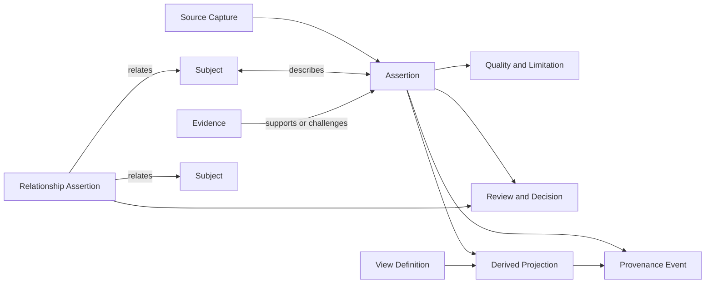
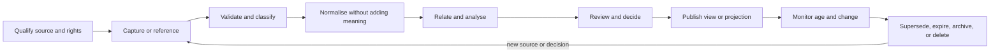

# Conceptual Data Architecture

## Document status

**Status:** Initial conceptual baseline for review

**Architecture stage:** Information Systems Architecture, Data Architecture

**Governing decision:** `DEC-019`

**Scope:** Information semantics and governance for the BIAN Adoption &
Engineering Platform

## 1. Purpose

This document defines the conceptual information model needed to support the
accepted Business Architecture without choosing a database, physical schema,
query language, or integration protocol.

The central design problem is not how to store BIAN files. It is how to preserve
different authorities and changing claims about BIAN, a bank estate, mappings,
architecture decisions, engineering assets, controls, evidence, and ownership
without presenting one source or inference as another.

## 2. Data Architecture objectives

The Data Architecture must:

- preserve exact, release-qualified BIAN identity and meaning from authorised
  sources;
- keep BIAN, bank, HSB, project, inference, third-party, and evidence records
  distinguishable;
- represent relationships as attributable, reviewable, time-aware assertions;
- preserve source-native identity and an independent platform identity;
- make provenance, derivation, review, quality, conflict, and limitations part
  of meaning;
- support historical reconstruction and controlled impact analysis;
- coexist with external systems of record without silently copying their
  authority;
- support customer control, portable export, retention, deletion, and exit;
- permit governed extension without changing authoritative BIAN semantics; and
- remain implementable through more than one credible storage architecture.

The depth of each information domain is deliberate:

| Information domain | Current proposition depth |
|---|---|
| BIAN source context | Core authority and provenance boundary; source-qualified content remains pending |
| Bank or HSB estate | Core synthetic decision input |
| Mapping and analysis | Core decision value |
| Architecture and transformation | Core decision outcome |
| Engineering projection | Thin connected proof only |
| Assurance and evidence | Thin connected proof only |
| Governance and operation | Supporting foundation; broad platform control remains north-star scope |

The [Phase C gap and traceability analysis](PHASE_C_TRACEABILITY.md) applies
these labels to each Data Architecture section, capability and value stream.
They constrain validation depth and do not remove the full-platform north star.

## 3. Baseline information problem

The platform must expect:

- different systems using different identifiers for the same apparent subject;
- one identifier being reused, renamed, merged, split, or corrected over time;
- incomplete, stale, contradictory, sensitive, and uncertain source records;
- an API or application implementing several responsibilities;
- several assets appearing to implement the same responsibility;
- mappings that are proposed, disputed, accepted, rejected, or superseded;
- derived projections that can be reproduced but are not authoritative source
  artefacts;
- architecture decisions that depend on an exact evidence and source scope;
- rights that permit reference or local use but restrict redistribution; and
- external authoritative systems changing independently of the platform.

A conventional entity catalogue that stores only the latest merged value would
lose the information needed to explain these conditions.

## 4. Governing information model

The conceptual model distinguishes a subject from claims made about it.

These are project-defined conceptual terms. They are not presented as BIAN
artefact types.

### Subject

A platform-minted identity anchor for a thing about which assertions may be
made. Examples include a BIAN model element, HSB application, API, integration,
architecture option, control, test, generated artefact, or owner role.

Registering a subject establishes only that the model needs a stable referent.
It does not assert that the thing exists, that an external source recognises it,
or that two source records identify the same thing. Those are separate,
attributable assertions.

A subject does not contain an unquestioned latest truth. Its usable view is
formed from assertions selected according to authority, scope, time, review,
and policy.

### Assertion

A claim by an identified authority about a subject. It records its authority
class, source, provenance, time context, ownership, review state and known
limitations. A required value that is unavailable is represented by an explicit
absence state rather than silently omitted.

Examples include:

- an authorised BIAN source defining the name of a model element;
- an HSB source declaring the owner of an application;
- a project rule assigning a review state;
- an inference proposing that an API operation maps to a BIAN concept; or
- a reviewer accepting that mapping as an HSB architecture assertion.

Acceptance changes the review and decision state. It does not change the
assertion into authoritative BIAN content.

### Relationship assertion

A claim that exactly two endpoint subjects are related in a particular way. It
is independently identified, sourced, versioned, reviewed, and limited.
Context that would otherwise produce a three-or-more-way link is represented by
an identified context subject or by assertions about the reified relationship
assertion. This preserves one relationship identity for review, history and
provenance without hiding extra participants in an edge.

This permits the model to represent:

- an authoritative BIAN relationship from an authorised source;
- an HSB application-to-BIAN mapping;
- an API provided by an application;
- an architecture decision affecting an asset;
- evidence supporting a control conclusion; or
- a generated artefact derived from an approved model version.

The relationship type, source, and authority must remain explicit. Similar
names do not establish a BIAN relationship.

### Source capture

An immutable, integrity-verifiable record of exactly what was obtained from an
external source, under which version, rights, and capture method. A source
capture may contain references rather than redistributed content when rights
require it.

### Provenance event

A record of acquisition, validation, normalisation, transformation, derivation,
mapping, review, projection, import, export, or other material processing. It
identifies inputs, outputs, method, version, configuration, actor, time, and
result.

### Review and decision

A human or authorised governance outcome applied to assertions,
relationships, findings, options, exceptions, or evidence. It records the
authority exercised, rationale, input scope, outcome, time, and supersession.

### Evidence

A scoped record that supports or challenges an assertion, requirement, control,
test result, finding, or conclusion. Evidence retains method, source, version,
time, reviewer, limitations, expiry, and integrity. Evidence does not become a
timeless fact.

### Derived projection

A deterministic representation generated from declared model inputs. A
normalised BIAN representation, API contract, event definition, report, view,
test, SDK, catalogue record, or other asset may be a projection. Its authority
and lineage remain distinct from its inputs. A projection is not an assertion.
If the platform or a user makes a claim based on it, that claim is a separate
assertion linked to the projection through provenance.

Class B applies only to a deterministic projection of source-qualified BIAN
content that adds no BIAN meaning. Reports and views that mix BIAN, bank,
project or inferred content retain the classes of their inputs and do not become
Class B merely because their production is deterministic.

### View definition

A governed, versioned selection policy that states which records may contribute
to a view, how authority, time, review state and unresolved conflict are handled,
which parameters apply, and what happens when a required value is absent. A
view definition produces a derived projection or materialisation. It does not
rewrite assertions or create a silent winning source.

### View materialisation

The reproducible result of evaluating a named and versioned View Definition
against an exact input set, evaluation time, parameters and transformation
version. It is a Derived Projection, not an assertion or a silent replacement
for the underlying records. `DAR-026` governs the information required to
reconstruct the exact materialisation used by a decision.

## 5. Authority and truth classification

The detailed operational classes remain those defined in the BIAN alignment
policy. The simpler product classes are presentation groupings, not replacements.

| Operational class | Meaning | User-facing truth grouping | Promotion rule |
|---|---|---|---|
| Class A | Authoritative BIAN assertion | External framework assertion | Only an authorised BIAN source can establish it |
| Class B | Mechanically derived BIAN projection | External framework assertion, clearly labelled as derived | Deterministic derivation never adds BIAN meaning |
| Class C | Project context or extension | Project context | Cannot become BIAN, bank truth or platform inference by review alone |
| Class D | Customer or HSB assertion | Customer assertion | Bank information steward or accountable asset owner governs review |
| Class E | Inference or recommendation | Platform inference | May be accepted as a bank or HSB decision input, never as BIAN fact |
| Class F | Third-party assertion | External framework assertion or third-party context | Retains external source, rights, scope, and review state |
| Evidence record | Scoped verification material rather than an assertion authority | Verified evidence | Supports a scoped conclusion without changing source authority |

Storage, APIs, exports, reports, and user interfaces must preserve the detailed
class even when displaying the simpler grouping.

Class C and Class E are deliberately separate. Project-authored namespaces,
workflow states and configuration are Class C. Analytical matches,
recommendations and other platform-produced claims are Class E.

## 6. Information domains

| Information domain | Primary concepts | Authority boundary |
|---|---|---|
| BIAN source context | release, artefact, model element, definition, relationship, lifecycle, integrity, rights | Authorised BIAN source; platform source steward qualifies capture and import |
| Bank or HSB estate | application, API, event, integration, data asset, vendor, owner, lifecycle, criticality | Bank source system and Bank information steward |
| Mapping and analysis | mapping proposal, rationale, evidence, confidence, conflict, finding, review | Analytical method proposes; accountable architecture and asset authorities decide |
| Architecture and transformation | current state, target state, option, constraint, dependency, decision, exception, action, roadmap | Architecture owner or recorded bank architecture approver |
| Engineering projection | model input, profile, generator, contract, schema, test, SDK, documentation, deployment asset, compatibility | Platform records lineage; engineering repository owns adopted delivery assets |
| Assurance and evidence | obligation, requirement, control, implementation, assessment, test, evidence, finding, exception, conclusion, expiry | External or bank authority defines obligation and control; scoped assessor and control owner govern conclusion |
| Governance and operation | identity, role, permission, policy, approval, workflow, audit, release, support, incident | Relevant bank, platform, or open-source governance authority |

Domains share identity, provenance, temporal, authority, quality, review,
sensitivity, and lifecycle concepts. They must not create hidden copies of those
cross-cutting concerns.

## 7. Identity and namespace model

Conceptually, an identifier contains or resolves to:

- the authority namespace;
- the subject or record type;
- an immutable local identifier;
- the applicable source release or version where identity is release-bound; and
- aliases or source-native identifiers as separately governed mappings.

The architecture must not use display names, file paths, URLs, storage primary
keys, or mutable external labels as its only identity.

Important cases include:

- the same BIAN identifier across releases with changed attributes;
- a renamed or deprecated source element;
- two sources using the same text identifier;
- one bank asset represented in several systems;
- a merge or split of bank assets;
- a mapping that applies only to one source and estate version; and
- exported records imported into another platform instance.

The precise identifier syntax remains `OQ-032`. Physical keys remain a later
design choice.

## 8. Temporal and version model

The foundational distinction is between when an asserted condition applied and
when the platform recorded it. Correction and supersession create new state and
retain the earlier state.

Source release, model version, review time, evidence validity and other temporal
needs remain record-specific design concerns under `OQ-033`. They are not
mandatory fields on every record and will not be fixed as one universal set in
this conceptual requirement baseline.

## 9. Provenance and derivation

Provenance is a network of versioned links between governed records. It must be
navigable from a record to its immediate origins and from an origin to its
recorded dependants.

Source capture, customer mapping, review, evidence and deterministic generation
retain their own semantics under `DAR-005`, `DAR-008`, `DAR-012`, `DAR-013` and
`DAR-017`. The model does not prescribe a universal pipeline or create duplicate
review and evidence records merely to complete a diagram.

## 10. Quality, uncertainty, and conflict

Quality is contextual rather than one universal score. Relevant dimensions may
include:

- source integrity and authority;
- completeness for the named decision;
- freshness and review age;
- identifier match quality;
- semantic confidence and supporting evidence;
- consistency with other sources;
- ownership and stewardship state;
- validation findings; and
- known limitations or unsupported scope.

Missing information is not evidence that something does not exist. Conflicting
assertions are retained and presented with their authorities and review state.
The project should prefer understandable qualitative states over an arbitrary
percentage until `OQ-036` is resolved.

## 11. System-of-record and reconciliation model

The platform distinguishes:

1. **external authoritative record:** governed by a BIAN source or bank system;
2. **immutable source capture:** what the platform received or referenced;
3. **normalised assertion:** a deterministic representation retaining source
   identity and provenance;
4. **derived identity relationship:** a separately attributable claim that
   records refer to the same or related subjects;
5. **reviewed mapping or decision:** a project, bank, or HSB governance record;
   and
6. **current view:** a materialisation produced by a named and versioned View
   Definition, not an erasure of alternatives or history.

No derived match, split or merge may rewrite its source records. A complete
workflow for matching, conflicts, splits and merges is deferred under `DAR-021`.
Contradictory assertions remain visible until an authorised decision selects an
outcome under `DAR-018`.

Any decision or output that relies on a current or selected view must retain the
exact View Definition version, evaluation parameters and time, input record
versions, transformation version, result identity or digest, and known
limitations required by `DAR-026`. A later policy or source change must not make
the view used for an earlier decision impossible to reconstruct.

Attribute-level source precedence, refresh expectations, conflict ownership,
and retained-versus-referenced information remain `OQ-038` and later
Application Architecture concerns.

## 12. Information lifecycle

Quarantine, rejection, withdrawal, rights restriction, legal hold, and deletion
are valid lifecycle paths and must not be hidden as errors.

## 13. Sensitivity, tenancy, and lifecycle control

The platform may hold no transaction or personal data and still contain highly
sensitive information, including application vulnerabilities, ownership gaps,
target states, control failures, integration paths, vendor positions, and
transformation plans.

The foundation therefore records customer or tenant ownership, sensitivity and
an access-policy reference for every governed record. Detailed access design
remains part of the trust-boundary and security view under `OQ-034`.

Residency, retention, deletion, archival and legal hold are deferred to the
bank-production gate under `DAR-022`, where approved legal, regulatory and
customer policies exist. Source use and redistribution are governed separately
by `DAR-023`. Physical encryption, isolation, policy engines and key management
remain later architecture decisions.

## 14. Extension and schema evolution

Authoritative BIAN semantics remain in an authority-controlled namespace.
Project, customer, HSB, regulatory, security-profile, vendor, and plugin
extensions use separate governed namespaces.

An extension may:

- add project workflow or review metadata;
- relate a bank assertion to a BIAN concept;
- add a customer-specific classification or decision;
- reference a security profile or regulatory source; or
- create a projection for an external tool.

It may not rename, redefine, or silently enrich a BIAN concept while continuing
to present the result as BIAN. Compatibility, migration, rollback and
historical-readability obligations enter scope at the platform-evolution
increment under `DAR-025`.

## 15. Portable exchange and customer control

For the bounded proposition, `DAR-016` gives the customer a minimum export set:

- all customer-supplied records;
- all platform-created mappings, reviews, decisions, findings and evidence that
  the customer owns or is entitled to retain;
- the relationships connecting those records; and
- the identity, authority, provenance, version and limitation information
  needed to interpret the exported set.

When rights prevent export of external content, the export retains its
identifier, release and source reference rather than silently omitting the
dependency or redistributing the content.

The project will not invent a general enterprise-architecture interchange
standard. Candidate formats and round-trip scope remain `OQ-035`.

## 16. HSB information slice

The first HSB Data Architecture exercise should include only information needed
for the accepted responsibility-allocation decision:

- a source-qualified BIAN context for the exact later-confirmed scope;
- an HSB decision question, criteria, sponsor, and authority;
- selected HSB applications, APIs, integrations, owners, lifecycle, and
  dependencies;
- deliberately incomplete and contradictory source assertions;
- candidate, rejected, disputed, accepted, and superseded mappings;
- at least two target options, including justified no change;
- one accepted allocation and transition decision;
- one model-derived projection linked to the decision;
- one scoped assurance evidence path with explicit gaps; and
- one BIAN-source or HSB-estate change that creates reviewable impact.

Expected results must be defined before the scenario is used as evidence.
Nothing in this slice represents a real bank or proves a BIAN relationship until
the exact source is qualified.

The first record-level instantiation is documented in
[Phase C model validation](PHASE_C_MODEL_VALIDATION.md). It uses synthetic HSB
records and an explicit project placeholder for the unresolved BIAN scope. It
therefore tests model coherence, not BIAN fidelity or real-bank feasibility.

## 17. Data governance responsibilities

Project accountability uses the canonical `ROL` vocabulary in the Architecture
Register. Asset owner and platform operator describe adopting-organisation
participants; each must be mapped to a named organisation role and decision
mandate when real-bank scope exists.

| Role | Data Architecture accountability |
|---|---|
| BIAN source steward | Qualify BIAN source identity, release, integrity, rights, import status, and detected source ambiguity |
| Source-rights reviewer | Determine allowed capture, transformation, retention, display, export, and redistribution |
| Bank information steward | Govern source ownership, quality, sensitivity, currency, correction, and reconciliation of bank or HSB estate assertions |
| Architecture owner | Govern mapping meaning, review, architecture decisions, exceptions, and supersession |
| Asset owner | Confirm or dispute factual assertions and actions for owned assets |
| Security owner | Govern classification, access, tenancy and sensitive information flows |
| Information governance owner | Govern approved residency, retention, deletion, archival and legal-hold obligations before real bank production use |
| Assurance owner | Govern evidence scope, sufficiency, finding, expiry, exception, and conclusion |
| Platform operator | Operate storage and exchange controls later selected without assuming semantic authority |
| Open-source maintainer | Govern public schemas, compatibility, migrations, releases, and disclosed support boundaries |

## 18. Requirements and risk traceability

The proposed and deferred `DAR-001` through `DAR-028` requirements are
maintained in the
[Architecture Register](../governance/ARCHITECTURE_REGISTER.md#data-architecture-requirements).
They principally refine:

- `REQ-002` through `REQ-006` for BIAN integrity, authority, model foundation,
  identity, provenance, and connected traceability;
- `REQ-007` through `REQ-010` for accountability, evidence, security, and HSB;
- `REQ-013` through `REQ-018` for coexistence, portability, runtime neutrality,
  extensibility, deterministic generation, and change impact; and
- `BAR-002` through `BAR-005`, `BAR-007`, `BAR-008`, `BAR-010`, `BAR-011`, and
  `BAR-014` for Business Architecture refinement.

The main Data Architecture risks are `RSK-005`, `RSK-006`, `RSK-013`,
`RSK-019` through `RSK-023`, and `RSK-033` through `RSK-035`.

## 19. Open questions and next analysis

The active Data Architecture questions are `OQ-032` through `OQ-038`, `OQ-048`
and `OQ-049`. The next
review should determine:

- whether the subject, assertion, and relationship-assertion separation is
  sufficient and understandable;
- whether every information domain can preserve its authority without a hidden
  second source of truth;
- which temporal, quality, sensitivity, and rights concepts are mandatory in
  the first HSB slice;
- which exact BIAN R14 sources can validate the model lawfully; and
- which logical application responsibilities are required to operate the model.

The record-level example resolves the earlier conceptual ambiguity about
subject registration, relationship arity, projection classification, Class C
and current-view governance under `DEC-024`. It does not settle the physical
schema or the evaluation language for View Definitions.

`DAR-010`, `DAR-011`, `DAR-014`, `DAR-019`, `DAR-020` and `DAR-026` remain
proposed because their acceptance evidence depends on logical Application
Architecture responsibilities. `DEP-013` and `WRK-040` keep that dependency
visible rather than allowing Data Architecture concerns to migrate silently.

## 20. Explicit non-decisions

This Data Architecture does not decide:

- graph versus relational versus document storage;
- one store versus several specialised stores;
- event sourcing, change-data capture, or batch synchronisation;
- query, API, messaging, or export protocols;
- physical tenancy and encryption design;
- indexing, caching, search, analytics, or AI implementation;
- retention periods or regional deployment; or
- implementation language, framework, or product.

Those choices require reviewed requirements, workloads, threats, rights,
operational objectives, and evidence.

## References

### Internal

- [Information Systems Architecture](INFORMATION_SYSTEMS_ARCHITECTURE.md)
- [Trust-boundary and security architecture](TRUST_BOUNDARY_AND_SECURITY_ARCHITECTURE.md)
- [Phase C model validation](PHASE_C_MODEL_VALIDATION.md)
- [Phase C gap and traceability analysis](PHASE_C_TRACEABILITY.md)
- [Architecture Vision](ARCHITECTURE_VISION.md)
- [Business Architecture](BUSINESS_ARCHITECTURE.md)
- [Requirements and traceability](REQUIREMENTS_AND_TRACEABILITY.md)
- [BIAN alignment policy](../product/BIAN_ALIGNMENT_POLICY.md)
- [Fictional bank and synthetic validation](../product/FICTIONAL_BANK_AND_SYNTHETIC_VALIDATION.md)
- [Project glossary](../governance/GLOSSARY.md)
- [Architecture Register](../governance/ARCHITECTURE_REGISTER.md)
