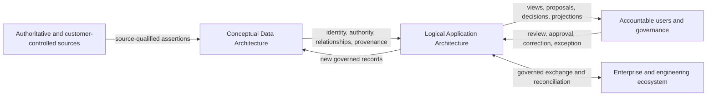

# Information Systems Architecture

## Document status

**Status:** Initial conceptual baseline for review

**Architecture stage:** Information Systems Architecture

**Decision authority:** `DEC-019`

**Scope:** Data Architecture and Application Architecture for the BIAN Adoption
& Engineering Platform

## 1. Purpose

This document establishes the boundary, concerns, viewpoints, and sequence for
Information Systems Architecture. It connects the accepted Business
Architecture to conceptual Data and Application Architecture without selecting
software products, storage technologies, deployment units, or implementation
frameworks.

The architecture begins with information because the product's differentiating
hypothesis depends on preserving meaning, authority, relationships, provenance,
review, evidence, and change across several capabilities. Application
responsibilities must follow those information boundaries rather than define
them accidentally.

## 2. Architecture outcome

Information Systems Architecture must explain:

- what information the platform needs and why;
- which authority can make each class of assertion;
- how identity, relationships, provenance, version, time, quality, review, and
  evidence are preserved;
- which information remains authoritative in external systems;
- which project records the platform governs itself;
- how information crosses trust and ownership boundaries;
- which logical application responsibilities create, validate, relate, review,
  project, exchange, or govern that information; and
- how the bounded HSB responsibility-allocation decision traverses the model.

The intended outcome is a coherent conceptual architecture that can later guide
technology evaluation and bounded experiments. It is not a logical deployment
or implementation design.

## 3. Governing inputs

The principal inputs are:

- the product north-star and fourteen use cases;
- the accepted bounded responsibility-allocation proposition under `DEC-018`;
- project principles `PRN-001` through `PRN-017`;
- cross-cutting requirements `REQ-001` through `REQ-020`;
- Business Architecture requirements `BAR-001` through `BAR-014`;
- the Business Architecture value streams, roles, information groups, decision
  rights, system-of-record boundaries, and HSB scenario;
- the six operational assertion classes in the BIAN alignment policy;
- the four user-facing classes of truth in the product vision;
- active risks, assumptions, dependencies, and evidence gaps in the
  Architecture Register; and
- exact authorised BIAN sources only when an artefact-level rights and
  provenance record exists.

Unresolved inputs remain visible. Information Systems Architecture must not
convert an open source-rights, buyer, stewardship, or BIAN semantic question
into an architectural fact.

## 4. Scope and exclusions

### In scope

- conceptual information domains and ownership;
- the canonical knowledge and assertion model;
- identity, namespaces, versions, time, lineage, review, and evidence;
- authority, quality, conflict, reconciliation, and system-of-record boundaries;
- sensitive-information and tenant concepts needed to shape trust boundaries;
- conceptual inbound, internal, and outbound information flows;
- logical application responsibilities and interactions;
- adapter, profile, plugin, projection, and experience-layer boundaries;
- logical services offered to users and integrated systems; and
- traceability to the HSB scenario, principles, requirements, risks, and
  evidence needs.

### Excluded at this stage

- physical schemas and database selection;
- graph, relational, document, search, event-stream, or object-store decisions;
- programming languages, frameworks, API protocols, and deployment topology;
- service decomposition into independently deployable workloads;
- Kubernetes, OpenShift, cloud, network, and infrastructure design;
- detailed user-interface design;
- production data migration and capacity design;
- implementation estimates or build authorisation; and
- claims that the conceptual model conforms to BIAN beyond exact,
  source-qualified imported content.

## 5. Stakeholders and concerns

| Stakeholder | Information Systems Architecture concern |
|---|---|
| Enterprise and domain architects | Explainable mappings, current and target context, decision history, impact, and portable views |
| BIAN source steward | Exact source identity, release, rights, integrity, semantic preservation, and unsupported gaps |
| Application and API owners | Accurate source assertions, review authority, conflicts, ownership, and affected actions |
| Security and information authorities | Sensitivity, tenancy, access, retention, data minimisation, audit, and trustworthy boundaries |
| Risk and control owners | Scoped linkage between requirements, controls, assessment, evidence, findings, gaps, and expiry |
| Engineering and platform teams | Stable contracts, deterministic projections, owned boundaries, compatibility, and governed integration |
| Operations | Failure isolation, reconciliation, observability, recovery, retention, growth, and support responsibilities |
| Open-source maintainers | Source rights, extension isolation, reproducibility, safe contribution, and sustainable scope |
| Adopting bank | System-of-record coexistence, customer control, export, exit, and no hidden authority transfer |

## 6. Baseline and target

### Baseline

The conceptual baseline is fragmented information held in BIAN sources,
architecture repositories, APM or CMDB records, API catalogues, source control,
GRC systems, diagrams, documents, and individual knowledge. Meanings,
identifiers, versions, mappings, decisions, and evidence may be inconsistent or
difficult to reconcile. Existing systems remain authoritative for the records
they own.

### Target

The target is a connected model that:

- imports or references authoritative information without impersonating its
  source;
- preserves assertions from different authorities without collapsing conflict;
- supports reviewed relationships between BIAN context and a bank estate;
- links mappings to architecture decisions, engineering projections, assurance,
  ownership, and change impact where those stages participate;
- provides portable, evidence-backed views and workflow; and
- remains independent of one BIAN artefact format, portal, vendor, runtime, or
  storage technology.

## 7. Architecture structure

The diagram is conceptual. It does not imply one database, one application, a
linear workflow, or a specific integration pattern.

## 8. External system boundaries

| External context | Authority retained externally | Platform relationship |
|---|---|---|
| Authorised BIAN sources | BIAN definitions, identifiers, relationships, release, and source status | Qualify, capture, validate, preserve, project, and report gaps within reviewed rights |
| Bank APM, CMDB, and architecture repositories | Application identity, ownership, lifecycle, approved architecture records, and target state as declared by the bank | Import or reference assertions, reconcile identity, connect review, and export decisions |
| API, event, and source repositories | Delivery contracts, versions, implementation records, and engineering ownership | Analyse, relate, generate projections, and report impact without replacing delivery authority |
| Identity and policy systems | User identity, group, authentication, and enterprise policy source | Consume governed identity and policy decisions with least privilege |
| GRC, control, and evidence systems | External obligations, bank control records, accepted evidence, and assurance workflow where declared | Link scoped records and findings without claiming general GRC authority |
| Developer portals and catalogues | Catalogue experience and lifecycle records they own | Publish and reconcile selected metadata through an adapter; do not make the portal the core model |
| Delivery and runtime platforms | Build, deployment, runtime, telemetry, and operational state | Exchange projections and evidence through later approved interfaces |
| HSB sources | Synthetic estate, owners, decisions, evidence, and change history | Provide reproducible, explicitly fictional test inputs and expected outcomes |

## 9. Data and Application Architecture boundary

Data Architecture defines meaning, identity, authority, information lifecycle,
quality, provenance, and exchange obligations. Application Architecture defines
the logical responsibilities that act on that information.

For example:

- Data Architecture defines what a source capture, assertion, mapping,
  relationship assertion, review, and evidence record mean.
- Application Architecture later defines which logical responsibility acquires,
  validates, reconciles, reviews, queries, projects, exports, and monitors those
  records.
- Technology Architecture later determines where and how those responsibilities
  and records are deployed and stored.

An application boundary must not create a new class of truth or remove
provenance for implementation convenience.

## 10. Planned viewpoints and sequence

1. **Conceptual Data Architecture:** information domains, core concepts,
   assertion classes, relationships, identity, provenance, time, review,
   quality, system-of-record boundaries, and lifecycle.
2. **HSB information scenario:** apply the model to the bounded
   customer-payment initiation decision, including ambiguity and change.
3. **Trust and sensitive-information view:** identify identity, tenancy,
   sensitivity, access, retention, evidence, and boundary concerns.
4. **Logical Application Architecture:** define application responsibilities,
   interactions, information ownership, integration seams, and user services.
5. **Cross-architecture traceability:** show how Data and Application
   Architecture satisfy accepted requirements and support the Business
   Architecture decision.

Data and Application Architecture may iterate together. Application design must
not prematurely settle unresolved information semantics.

## 11. Initial architecture requirements

The proposed Data Architecture requirements are `DAR-001` through `DAR-017` in
the
[Architecture Register](../governance/ARCHITECTURE_REGISTER.md#data-architecture-requirements).
They refine `REQ-002` through `REQ-018` and `BAR-002` through `BAR-014` where
applicable. Their status and wording are not duplicated here.

Application Architecture requirements will be proposed only after the logical
responsibilities and interactions have been developed.

## 12. Stage review criteria

Information Systems Architecture is ready for its next gate when:

- conceptual Data and Application Architecture views are coherent;
- exact BIAN assertions remain source-qualified and separate from project
  concepts;
- identity, authority, provenance, relationships, time, quality, review, and
  evidence have explicit semantics;
- system-of-record and reconciliation responsibilities are clear;
- sensitive information, tenancy, retention, export, and trust concerns are
  visible even where unresolved;
- the HSB scenario can traverse the architecture without hidden information or
  authority changes;
- proposed domain requirements have explicit review outcomes;
- material risks and open questions have owners and later gates;
- no physical technology choice has been smuggled into the conceptual model;
  and
- the project owner agrees that Solution Architecture may be considered after
  the remaining conceptual views and gates are complete.

## 13. Current limitations

- Exact BIAN R14 structures for the initial scenario are not yet ingested or
  source-qualified.
- Real-bank information availability, buyer demand, and stewardship effort
  remain unvalidated.
- The conceptual model has not been tested against a physical storage or query
  workload.
- Tenancy, residency, retention, evidence, and rights rules require further
  security, legal, and operational analysis.
- Logical Application Architecture has not yet been defined.

These limitations are deliberate register inputs, not reasons to invent an
answer or stop conceptual progress.

## References

### Internal

- [Architecture Vision](ARCHITECTURE_VISION.md)
- [Business Architecture](BUSINESS_ARCHITECTURE.md)
- [Requirements and traceability](REQUIREMENTS_AND_TRACEABILITY.md)
- [Project principles](../product/PROJECT_PRINCIPLES.md)
- [BIAN alignment policy](../product/BIAN_ALIGNMENT_POLICY.md)
- [Fictional bank and synthetic validation](../product/FICTIONAL_BANK_AND_SYNTHETIC_VALIDATION.md)
- [Architecture Register](../governance/ARCHITECTURE_REGISTER.md)

### Method context

- [The TOGAF Standard, 10th Edition](https://publications.opengroup.org/standards/togaf)
