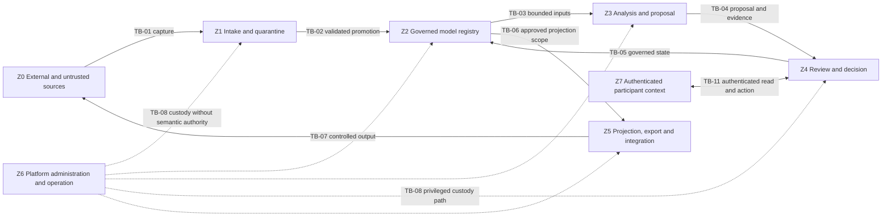
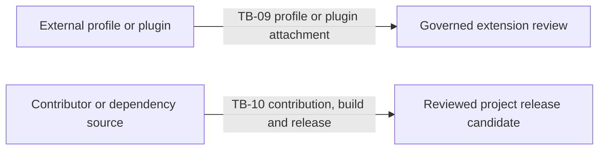

# Trust-boundary and security architecture

## Document status

**Status:** Accepted conceptual baseline under `DEC-026`

**Architecture stage:** Information Systems Architecture, cross-cutting trust and
security view

**Governing records:** `PRN-007`, `REQ-009`, `DAR-014`, `DEC-026`, `WRK-011`,
`WRK-041`

**Scope:** Trust boundaries, protected information, threat and abuse cases,
control outcomes, failure behaviour and security evidence for the first HSB
proposition, with explicit north-star boundaries

## 1. Purpose

This document defines where trust changes across the BIAN Adoption & Engineering
Platform and what must remain true when information, decisions and generated
outputs cross those boundaries.

The purpose is not to select identity products, cryptographic mechanisms,
network topology, policy engines or deployment platforms. It is to ensure that
later Application, Technology and Solution Architecture can make those choices
against explicit information, threat, authority and evidence requirements.

Security in this architecture protects more than confidentiality. It also
protects:

- the exact authority and provenance of BIAN-attributed content;
- the integrity and ownership of bank or HSB assertions;
- the distinction between assertion, inference, decision and evidence;
- the ability to reconstruct the information used for a decision;
- customer control over sensitive architecture information and exports; and
- the reliability of generated outputs without treating them as trusted code.

## 2. Security position

The architecture applies the following positions:

1. Semantic authority and operational trust are different. An authorised BIAN
   source may establish BIAN meaning, but content received from any external
   source remains operationally untrusted until captured and validated.
2. Authentication does not grant semantic authority. A verified identity may
   act only within an explicitly delegated decision right and information scope.
3. Platform administration does not grant authority to approve a BIAN meaning,
   bank assertion, architecture decision or assurance conclusion.
4. Analysis and generated outputs are untrusted proposals until their declared
   verification and review conditions are satisfied.
5. Provenance supports trust decisions but does not prove correctness, safety or
   permission by itself.
6. Access is denied when ownership scope, sensitivity, purpose or policy cannot
   be determined. Missing policy is not implicit permission.
7. Security conclusions retain assessed scope, method, evidence, limitations
   and review state. No control or profile produces a blanket compliance claim.

These are project-defined security positions. They are not attributed to BIAN.

## 3. Scope depth

| Area | Current depth | Reason |
|---|---|---|
| HSB information intake and classification | First-proposition core | The decision cannot be trusted if estate assertions enter without ownership, sensitivity and source context |
| BIAN source intake | Core boundary, source-qualified exercise pending | The architecture must prevent project or malicious content from acquiring BIAN authority before exact source ingestion is approved |
| Governed registry and truth separation | First-proposition core | Identity, provenance, class, review and history are the trust foundation |
| Analysis, inference and human decision | First-proposition core | The primary abuse case is an unsupported proposal becoming apparent truth or an approved decision |
| One security profile and evidence path | Thin connected proof | It tests separation of requirement, control, verification, evidence and conclusion without creating a general GRC product |
| Projection and export | Thin connected proof | It tests provenance, ownership, sensitivity, generated-versus-owned boundaries and egress control |
| Multi-tenant hosted operation | North-star | Logical ownership is required now; physical tenant isolation needs later deployment requirements and evidence |
| Executable plugins and external AI services | North-star boundary | Their trust consequences are defined now, but no execution or provider model is approved |
| Open-source software supply chain | Supporting future release control | Repository and disclosure controls exist; deployable supply-chain design follows implementation authorisation |
| Bank production resilience, privacy and lifecycle | North-star production depth | Exact policy, jurisdiction, workload and operating environment remain unknown |

## 4. Protected information and assets

| Asset | Security concern | Required protection outcome |
|---|---|---|
| BIAN source captures and source-qualified assertions | Substitution, tampering, invented semantics, rights breach | Exact source identity, release, integrity state, rights decision, immutable capture, quarantine and attributable processing |
| HSB or future bank estate records | Sensitive topology, ownership, vulnerability, lifecycle and dependency exposure | Customer scope, sensitivity, purpose-limited access, minimisation, correction and controlled export |
| Mappings, findings and inferences | Manipulation, false confidence, hidden promotion to fact | Method and input provenance, truth class, uncertainty, review state, conflict visibility and no automatic authority promotion |
| Architecture decisions and View materialisations governed by `DAR-026` | Spoofed approval, changed inputs, irreproducible decision basis | Delegated decision right, exact input and view identity, immutable history, supersession and audit |
| Security profiles and policy mappings | Misconfiguration, unauthorised change, misleading coverage | Separate project or customer namespace, versioning, approval, applicable scope and evidence-linked outcome |
| Evidence and assurance conclusions | Fabrication, expiry, overclaiming, detached context | Integrity, method, scope, validity, limitations, reviewer and explicit unsupported areas |
| Generated artefacts and exports | Malicious content, data leakage, overwritten owned content, false trust | Deterministic provenance, output classification, verification, egress policy, disposable boundary and explicit ownership |
| Credentials, tokens and signing material | Account or supply-chain compromise | Never represented as normal registry content; later secret-management boundary, minimal exposure and attributable use |
| Audit and provenance records | Deletion, selective history or repudiation | Append-preserving history, restricted administrative action, exportability and integrity evidence appropriate to the release state |

The first proposition does not require transaction data, customer personal data
or production credentials. Their introduction would change the privacy and
security scope and requires explicit architecture review.

A View materialisation is the reproducible result of evaluating a named and
versioned View Definition against an exact input set and evaluation context. It
is the current-view concept defined in the Data Architecture and governed by
`DAR-026`, not a separate trust-model record type.

## 5. Conceptual sensitivity and ownership

The model needs a small project-level vocabulary before a real bank taxonomy is
known. It must support at least:

| Classification | Intended use | Default handling |
|---|---|---|
| Unclassified | Ownership, sensitivity or external classification is absent, invalid or not yet mapped | Retain the explicit unclassified state, handle as restricted, block sensitive action and egress, and route classification for review |
| Public | Content deliberately approved for unrestricted publication | May leave the project boundary after rights and attribution checks |
| Project internal | Non-sensitive working architecture and project governance | Available only to authorised project participants until publication review |
| Customer or HSB confidential | Estate, mapping, decision or evidence information scoped to one customer or synthetic-bank context | Restricted to that ownership scope; excluded from public output by default |
| Security sensitive | Threats, weaknesses, control gaps, access paths or incident details | Need-to-know access, minimised output and no public issue or routine log exposure |
| Secret | Credentials, private keys, tokens or equivalent authentication material | Prohibited from ordinary platform records, fixtures, logs, exports and generated artefacts |

These labels are project defaults and do not replace a bank's classification or
privacy policy. Future adapters map external classifications without silently
weakening them. Unclassified is a visible information state, not a silently
applied label. Its restricted handling is a control response until review.

Every governed record retains an ownership scope and access-policy reference
under `DAR-014`. HSB is one synthetic ownership scope, not evidence of physical
multi-tenant isolation.

### Privacy position

The absence of bank customer data does not remove privacy concerns. Human
identity, reviewer attribution, approval and denial attempts, decision history,
audit events and support records can be personal information about project or
adopter participants. The first HSB exercises use synthetic participant
identities. Before real participant identities are retained, the architecture
must define purpose, minimum attributes, access, retention, correction, export
and deletion behaviour from the applicable policy and legal context.

Append-preserving history protects decision accountability; it is not a promise
to retain every raw personal attribute forever. Correction, supersession,
minimisation, de-identification or deletion may need to preserve a decision's
meaning without preserving unnecessary personal information. The unresolved
policy boundary is recorded in `OQ-052` and must be resolved before a later
implementation makes an incompatible persistence choice.

## 6. Logical trust zones

Trust zones are logical responsibility and policy boundaries. They are not
deployable services, network segments or product choices.

### Runtime and participant boundaries



All dotted paths from Z6 are instances of `TB-08`. The explicit Z6 to Z4 path
shows the technical reach assumed by `THR-09`; it does not grant semantic or
decision authority.

### Lifecycle boundaries outside the runtime zone model

`TB-09` and `TB-10` occur while extensions and project releases are admitted,
not while a normal runtime information flow is executed. They are shown
separately so boundary completeness can be assessed across both diagrams.



### Z0: External and untrusted sources

Includes authorised BIAN sources, HSB or bank systems, third-party standards,
architecture and API repositories, source-control and delivery systems, plugin
packages, external analysis providers and user-supplied files.

An external source may hold semantic or organisational authority for its own
assertions. That does not make its content safe to parse, execute, display or
forward without validation.

### Z1: Intake and quarantine

Captures or references the exact input, applies source, rights, type, size,
integrity and structural checks, records explicit failures and prevents rejected
or ambiguous content from entering the governed registry as accepted content.

Quarantine is a valid outcome. An intake process cannot create missing BIAN
semantics or silently repair a source while retaining BIAN attribution.

### Z2: Governed model registry

Holds governed identity anchors, captures, assertions, relationships, decisions,
evidence, provenance and versions. Its trust property is not that every record
is true. It is that each record's authority, ownership, source, review state,
time, limitations and relationships remain explicit.

### Z3: Analysis and proposal

Produces candidate mappings, findings, recommendations, views and other derived
outputs. It receives only the information needed for the declared method and
must treat source text as data, not executable instruction.

An analysis method, including future AI assistance, cannot write authoritative
BIAN or bank truth, approve its own output, or hide unsupported inputs.

### Z4: Review and decision

Allows an authenticated participant to review information and exercise a
delegated decision right. Approval is limited to the participant's scope. The
decision records the actor, authority exercised, exact inputs, alternatives,
rationale, outcome, time and supersession.

### Z5: Projection, export and integration

Creates deterministic projections and controlled exchanges. Output must retain
truth class, source, ownership, sensitivity, limitations and applicable BIAN
release. Egress is blocked when the output would violate ownership, rights,
classification or generated-versus-owned boundaries.

### Z6: Platform administration and operation

Maintains availability, configuration, recovery and technical access. Operator
privilege is not semantic or decision authority. Administrative actions that
can affect governed records, policy or audit history require attribution and
later evidence appropriate to the release state.

### Z7: Authenticated participant context

Represents an architect, steward, reviewer, maintainer or other participant
outside platform processing. The participant crosses `TB-11` to read a
purpose-bounded view or attempt an action. Authentication establishes identity,
not permission, ownership scope or delegated decision authority. Read responses
must apply the same non-disclosure, classification and provenance rules as
exports without treating interactive access as `TB-07`.

## 7. Trust-boundary catalogue

| Boundary | Trust change | Principal threats | Required control outcome | Current validation depth |
|---|---|---|---|---|
| `TB-01` External source to intake | Uncontrolled content enters project custody | Source impersonation, malicious payload, prompt or content injection, rights breach, excessive data | Allowlisted source context, immutable capture or reference, validation, minimisation, rights decision, quarantine and no execution | HSB synthetic negative cases now; authorised BIAN case after `GAT-004` |
| `TB-02` Intake to governed registry | Captured input may become usable assertion or projection | Invalid promotion, lost provenance, changed source meaning, classification omission | Explicit validation result, operational class, ownership, sensitivity, provenance, release and limitations; rejection remains visible | Core model and later HSB scenario |
| `TB-03` Registry to analysis | Governed information enters a method that can create new outputs | Over-collection, sensitive-data exposure, poisoned context, non-repeatable result | Purpose-bounded input set, method and version, least data, isolated output namespace, deterministic or declared non-deterministic behaviour | First-proposition core |
| `TB-04` Analysis to review | Proposal may influence a human decision | Automation bias, false confidence, hidden class, manipulated rationale | Inference label at point of use, supporting and contrary evidence, uncertainty, limitations, conflict visibility and no self-approval | First-proposition core |
| `TB-05` Review to governed state | Human action changes accepted status or authorises downstream action | Spoofed actor, excess authority, silent conflict resolution, repudiation | Authenticated identity, delegated decision right, scoped permission, exact input set, rationale, audit and supersession | HSB role simulation; real identity later |
| `TB-06` Registry to projection | Governed information becomes an artefact, view or export | Data leakage, class loss, stale input, embedded malicious content, overwritten ownership | Approved input scope, deterministic provenance, classification preservation, content validation, generated boundary and output evidence | Thin connected proof |
| `TB-07` Platform to external system or user | Information leaves platform control | Rights breach, over-sharing, confused ownership, partial failure, unrecorded drift | Destination and purpose policy, least privilege, rights and sensitivity check, acknowledgement, failure handling, audit and reconciliation | One HSB export path; broader integration later |
| `TB-08` Operator to governed zones | Technical custody can affect policy or stored state | Privilege abuse, audit tampering, semantic approval by administrator | Separate operator identity, bounded administration, attributable change, protected history, recovery and no implicit decision authority | Conceptual now; implementation evidence later |
| `TB-09` Profile or plugin attachment | Extension can change processing or control expectations | Semantic contamination, unsafe code, dependency compromise, profile overclaim | Separate namespace, declared permissions, compatibility, isolation, signed or integrity-verifiable package later, failure containment and scoped claims | Profile metadata thin proof; executable plugin north-star |
| `TB-10` Open-source contribution and release | External contribution becomes trusted project output | Malicious change, dependency compromise, secret disclosure, unsigned release | Review, automated verification, least-privilege workflow, dependency and secret controls, reproducible release and disclosure process | Required before `GAT-009` |
| `TB-11` Participant access to review and decision | A human identity requests governed information or attempts an action | Unauthorised read, cross-scope discovery, excess decision rights, session misuse, repudiation | Authentication, purpose and ownership-scoped read policy, non-disclosing denial, separate delegated action authority, session and audit controls later | HSB participant and cross-scope access scenarios now; real identity later |

## 8. Identity, access and decision authority

Logical identities include:

- human participants;
- external source systems;
- platform workloads;
- analysis and generation methods;
- integration destinations; and
- platform operators.

The later access model must support:

- unique and attributable identities rather than shared accounts;
- separate human and workload identity;
- ownership-scope and sensitivity-aware authorisation;
- least privilege and deny-by-default behaviour;
- purpose-bounded service access;
- explicit delegated decision rights separate from record access;
- attributable privileged and policy changes;
- revocation without loss of decision history; and
- an explicit unavailable or indeterminate state when an identity or policy
  dependency cannot provide a trustworthy decision.

The conceptual view does not select an identity provider, token format,
authorisation language, role model or cryptographic mechanism. Those decisions
follow logical Application Architecture and Technology Architecture.

## 9. Security profiles and control evidence

A security profile is a project, customer or third-party governed extension. It
is never a BIAN assertion. A profile may identify:

- the intended context and protected journey;
- source security or policy requirements;
- control objectives and responsibility boundaries;
- required configuration or implementation properties;
- verification methods and evidence expectations;
- exceptions, unsupported areas and expiry; and
- the exact conclusion that the evidence permits.

The evidence chain is:

```text
source or policy requirement
        -> control objective
        -> accountable responsibility
        -> implementation or configuration
        -> verification method and result
        -> evidence and finding
        -> scoped conclusion, gap or exception
```

The first proposition needs one project-defined HSB security profile sufficient
to exercise this chain. It must not be labelled as a bank, regulatory, FAPI or
other external profile unless its authoritative source and permitted use have
been established.

## 10. Threat and abuse-case analysis

The plausible threat actors and failure sources are:

- an unauthenticated external actor or malicious source supplier;
- an authenticated participant acting accidentally or outside delegated scope;
- a compromised or malicious operator, maintainer or contributor;
- a compromised workstation, source-control account, dependency or build path;
- malformed, adversarial or excessive source content; and
- an accidental dependency, integration, analysis or recovery failure.

Priority is a current solo-project implementation order, not a measured risk
score. `P1` is one of the first three threats to address before admitting code
or source artefacts. `P2` is required for the bounded HSB path. `P3` becomes
active with the relevant integration, plugin, hosted or production scope. A
real bank deployment can change this ordering.

| ID | Priority | Threat or abuse case | Security consequence | Required response |
|---|---|---|---|---|
| `THR-01` | P2 | A user supplies a modified file and labels it as an authorised BIAN artefact | Project content acquires false BIAN authority | Source qualification, integrity and release checks fail closed; content remains quarantined and non-BIAN |
| `THR-02` | P2 | Source text contains instructions intended to manipulate an analysis or future AI method | Untrusted content changes processing or causes disclosure | Treat content as data, constrain method inputs and tools, isolate outputs, retain method provenance and require review |
| `THR-03` | P2 | An HSB or bank record remains Unclassified or lacks ownership | Sensitive information becomes broadly visible or exportable | Preserve the explicit Unclassified or missing-ownership state, handle as restricted, block affected egress and create accountable review work |
| `THR-04` | P2 | A mapping inference is displayed or exported without its truth class | A user acts on an unsupported relationship as fact | Point-of-use classification is mandatory; output verification fails when class or provenance is lost |
| `THR-05` | P2 | An authenticated user reads or approves outside their ownership or delegated decision scope | Confidential information is disclosed or unauthorised state appears legitimate | Separate scoped read access from decision right, deny without disclosing protected record existence and record the attempt without changing governed state |
| `THR-06` | P2 | An analysis method selects one of two contradictory owner assertions | Conflict is silently converted into truth | Preserve both assertions; only an authorised recorded decision may select an outcome under `DAR-018` |
| `THR-07` | P3 | A generator or plugin modifies authoritative records or owned implementation | Source truth or bank-owned content is corrupted | Read-only bounded inputs, isolated output, disposable generation and explicit owned boundaries |
| `THR-08` | P2 | An export includes rights-restricted BIAN content or security-sensitive HSB details | Legal, confidentiality or security breach | Rights and sensitivity-aware output policy, minimum necessary content, references in place of restricted content and auditable denial |
| `THR-09` | P3 | An operator uses technical access to alter Z4 decision-processing policy or the decision and audit records retained in Z2 | Accountability and historical reconstruction fail | Separate custody from decision authority, attribute privileged change and preserve recoverable history |
| `THR-10` | P2 | Evidence expires or a source is withdrawn without downstream review | A decision or security conclusion continues to appear supported | Place maintained dependants into impact review under `DAR-020`; preserve earlier historical state |
| `THR-11` | P2 | Credentials or tokens enter fixtures, logs, evidence or generated artefacts | Account compromise or uncontrolled disclosure | Prohibit secrets in governed content, scan later delivery paths, minimise logging and use a separate future secret boundary |
| `THR-12` | P3 | An external system is unavailable or partially applies a change | Registry and external system drift without clear ownership | Fail without fabricating success, retain reconciliation state, retry safely where later approved and route unresolved drift to an owner |
| `THR-13` | P1 | The maintainer's workstation or source-control account is compromised | An attacker can alter architecture, code, workflow, secrets or release state under a legitimate identity | Protect device and account access, minimise long-lived credentials, require recoverable source history and introduce independent release verification before publication |
| `THR-14` | P1 | A dependency, build action or release input is compromised across `TB-10` | Malicious code or artefacts enter a trusted project release | Minimise dependencies, verify source and integrity, isolate builds, retain dependency and build provenance, and require reproducible release evidence later |
| `THR-15` | P1 | An oversized, deeply nested or malformed artefact exhausts intake resources | Availability is lost or validation controls are bypassed through parser failure | Bound accepted size and structural complexity, stream or isolate parsing where later selected, enforce resource and time limits, and fail in quarantine |

## 11. Failure and recovery behaviour

| Failure | Safe conceptual behaviour | Evidence needed later |
|---|---|---|
| Source unavailable or cannot be authenticated | Do not substitute another source or claim current BIAN context; retain last qualified state with age and limitation | Availability event, source identity, affected scope and user-visible limitation |
| Integrity, type or rights check fails | Quarantine or reject without promotion; preserve the attributable failure record | Capture reference, method, result, reason and reviewer where overridden by a permitted process |
| Identity or policy decision is unavailable | Deny state-changing and sensitive access; do not silently fall back to broad permission | Dependency state, denied action, affected journey and recovery outcome |
| Analysis or generation fails | Preserve inputs and prior accepted state; publish no partial result as complete | Method version, input set, failure, partial outputs and clean-up result |
| External destination partially accepts an exchange | Keep reconciliation incomplete and visible; do not mark the external state as aligned | Destination response, records accepted or rejected, retry or compensating decision |
| Registry state or audit history is unavailable | Prevent approvals or projections that cannot retain required evidence; restore to a known state later | Backup, integrity, restore, loss assessment and affected-decision review |
| Evidence becomes unavailable, invalid or expired | Retain historical evidence identity and place dependant conclusions into review | Validity change, affected records, owner notification and decision outcome |

Recovery objectives, backup design, regional resilience and service levels are
Technology and Solution Architecture concerns. The invariant is that recovery
must not silently change authority, accepted state or history.

## 12. HSB negative security scenarios

The connected HSB scenario should exercise at least these cases before the trust
view contributes acceptance evidence:

| Scenario | Expected outcome | Evidence produced |
|---|---|---|
| Spoofed BIAN-labelled input | Input is quarantined and cannot create Class A assertions | Capture, validation failure, source decision and visible unsupported BIAN scope |
| Missing HSB ownership and sensitivity | Record remains restricted and cannot enter an export until reviewed | Explicit absence states, denied output and review action |
| Oversized or malformed source artefact | Intake terminates within declared resource bounds and the artefact remains quarantined | Size or complexity limit, failure state, resource outcome and no promoted records |
| Conflicting application owners | Both source assertions remain visible; no automatic winner | Conflict view, source provenance and unresolved decision state |
| Instruction-like text in an imported description | Text is retained as data and cannot invoke tools, change policy or alter truth class | Bounded method input, sanitised presentation and analysis limitation |
| Mapping inference with its label removed | View or export validation fails | Failed verification identifying missing truth class and provenance |
| Out-of-scope approval attempt | Action is denied and governed state remains unchanged | Actor, attempted action, decision scope and denial record |
| Projection attempts to overwrite owned content | Generation fails or writes only to its disposable boundary | Input and output paths, ownership classification and verification result |
| Evidence expiry or source withdrawal | Every maintained dependant enters impact review; historical decision remains reconstructable | Impact set, affected owners, current limitation and retained prior view |
| Cross-scope read using a second synthetic ownership label | Access is denied without confirming whether the protected record exists | Policy decision and non-disclosing denial evidence |

These scenarios are synthetic internal evidence. They cannot establish security
of an implementation that does not yet exist or fitness for a bank environment.

## 13. Control and evidence responsibilities

The role names identify conceptual accountability and decision lenses. They do
not imply that the current solo project has independent staffing.

| Responsibility | Accountable role | Boundary obligation |
|---|---|---|
| BIAN source qualification | BIAN source steward | Establish exact source and release identity without assuming operationally safe content |
| Source permission | Source-rights reviewer | Permit or block capture, transformation, display, export and redistribution |
| HSB or bank information | Bank information steward | Own quality, sensitivity, correction and source-system boundaries |
| Trust and security risk | Security owner | Maintain threat, control, exception and residual-risk position |
| Mapping and architecture decision | Architecture owner | Prevent inference or access privilege from becoming decision authority |
| Evidence conclusion | Assurance owner | Preserve assessed scope, sufficiency, limitations, expiry and permitted claim |
| Technical custody and recovery | Operations owner | Operate access and recovery without acquiring semantic authority |
| Generated and owned boundary | Engineering owner | Keep generated output isolated, reproducible and disposable |
| Public contribution and release | Open-source maintainer | Protect repository, dependency, build, release and disclosure paths |

Logical Application Architecture must allocate the corresponding platform
responsibilities and interactions. Technology Architecture must then identify
the logical technology capabilities needed to enforce and evidence them.

## 14. Traceability and current gaps

This view principally refines:

- `PRN-003`, `PRN-005` through `PRN-007`, `PRN-011` through `PRN-015`;
- `REQ-002`, `REQ-003`, `REQ-005` through `REQ-009`, `REQ-011` through
  `REQ-018`, `REQ-020`, `REQ-022`, `REQ-024` and `REQ-025`; and
- `DAR-002` through `DAR-005`, `DAR-007` through `DAR-020`, `DAR-023`,
  `DAR-026` and `DAR-027`.

The active security questions and evidence gaps remain in the Architecture
Register. In particular:

- the exact future bank classification and access model is not known;
- the participant privacy and append-preserving accountability boundary remains
  open under `OQ-052`;
- a hosted multi-tenant architecture is not approved;
- no identity, policy, cryptographic, secret-management or isolation technology
  is selected;
- workstation and source-control compromise, build and dependency compromise,
  and intake resource exhaustion remain active risks under `RSK-039` through
  `RSK-041`;
- the source-qualified BIAN scenario remains blocked by `GAT-004`;
- there is no implemented control or penetration, resilience or recovery
  evidence; `EVD-012` records that limitation; and
- there is no independent security review.

## 15. Stage review tests

The trust view is sufficient to support the connected HSB scenario only when:

| Test | Pass evidence | Failure condition |
|---|---|---|
| Boundary completeness | Every HSB runtime and participant flow maps to `TB-01` through `TB-08` or `TB-11`, and every profile, plugin, contribution and release flow maps to lifecycle boundary `TB-09` or `TB-10` | A flow is absent from both diagrams or crosses trust without a named boundary |
| Protected information | Every scenario record has ownership, sensitivity and access-policy state, including an explicit Unclassified state where classification is absent | Unclassified or missing state is omitted, treated as public or granted unrestricted use |
| Authority separation | Identity, administration, inference, review and evidence roles remain distinct in the scenario | Authentication or operator privilege becomes semantic approval |
| Threat priority | The three current `P1` threats have register risks, accountable owners, required gate outcomes and a stated response | A realistic current attack path is unranked, has no governed risk or can enter later delivery without a control obligation |
| Negative paths | Each HSB negative scenario has an expected non-success outcome and evidence | A denial, quarantine, conflict or partial failure is hidden as generic success |
| Egress control | Export and projection preserve rights, sensitivity, truth class, provenance and ownership | Restricted content leaves or an output loses the context needed for safe use |
| Failure behaviour | Unavailable identity, policy, source, analysis, destination and registry states fail without inventing trust | The platform silently broadens access, substitutes truth or loses decision history |
| Scope honesty | Synthetic, conceptual and unverified limitations are present at the point of conclusion | Documentation implies implemented, independently assessed or bank-ready security |
| Application hand-off | Every required enforcement, review, evidence and recovery responsibility has an Application Architecture owner or explicit unresolved record | A control outcome depends on an unnamed component or hidden manual action |

## 16. Explicit non-decisions

This view does not decide:

- identity provider, authentication protocol or token format;
- role-based, attribute-based, relationship-based or policy-as-code product;
- network segmentation, service mesh, gateway, firewall or zero-trust product;
- single-tenant versus multi-tenant deployment topology;
- encryption algorithms, key ownership, key-management service or certificate
  model;
- secrets product or credential lifecycle implementation;
- database security, row-level policy or physical tenant isolation;
- plugin runtime, sandbox, external AI provider or model;
- security information and event management, monitoring or incident products;
- backup technology, recovery objectives or regional deployment;
- security testing tools, assurance framework or compliance certification; or
- container, Kubernetes, OpenShift, cloud or on-premises runtime.

Those decisions require logical Application Architecture, Technology
Architecture, measurable quality attributes, source rights, deployment context,
threat evidence and an authorised implementation scope.

## References

### Internal

- [Architecture Vision](ARCHITECTURE_VISION.md)
- [Business Architecture](BUSINESS_ARCHITECTURE.md)
- [Information Systems Architecture](INFORMATION_SYSTEMS_ARCHITECTURE.md)
- [Conceptual Data Architecture](DATA_ARCHITECTURE.md)
- [Phase C model validation](PHASE_C_MODEL_VALIDATION.md)
- [Phase C gap and traceability analysis](PHASE_C_TRACEABILITY.md)
- [Requirements and traceability](REQUIREMENTS_AND_TRACEABILITY.md)
- [Project principles](../product/PROJECT_PRINCIPLES.md)
- [BIAN alignment policy](../product/BIAN_ALIGNMENT_POLICY.md)
- [Security policy](../SECURITY.md)
- [Architecture Register](../governance/ARCHITECTURE_REGISTER.md)
