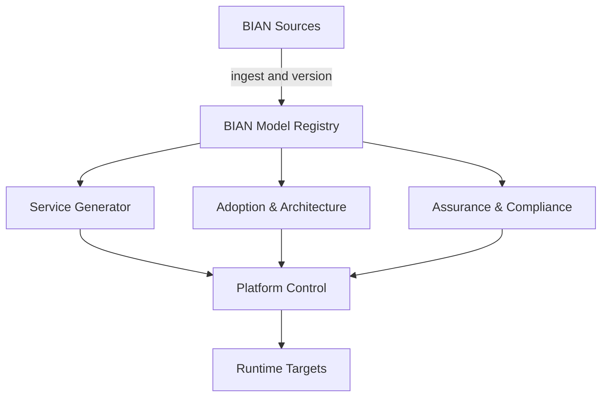

# Product vision

## Working proposition

The BIAN Adoption & Engineering Platform helps banks use BIAN as a practical,
model-driven foundation for understanding, designing, governing, engineering,
and changing their technology estate.

It connects three things that are normally separate:

1. **BIAN's model of banking:** Service Domains, APIs, events, Business
   Objects, Business Scenarios, capabilities, and relationships.
2. **The bank as it exists:** applications, APIs, integrations, data,
   technology, owners, controls, vendors, and lifecycle state.
3. **The bank as it wants to become:** target architecture, engineering
   standards, migration plans, governance decisions, and assurance evidence.

The result should allow a bank to ask meaningful questions and receive answers
grounded in traceable information rather than generic advice.

## The problem

Banks do not generally start with a clean collection of BIAN-aligned services.
They have large application portfolios, overlapping APIs, accumulated legacy
technology, inconsistent ownership, duplicated capabilities, and incomplete
architecture records.

BIAN can provide a useful common functional language, but adoption remains hard:

- teams struggle to relate BIAN concepts to their actual estate;
- generating an API does not establish who should own or implement it;
- architects cannot easily measure current alignment or model target states;
- BIAN release changes are difficult to connect to bank-specific impact;
- security and regulatory requirements sit outside most generation workflows;
- executives cannot see whether adoption is producing measurable improvement;
- architecture guidance often remains detached from engineering delivery.

## Product promise

The platform should help a bank move through a continuous adoption cycle:

```text
Understand the BIAN model
          ↓
Map the current bank estate
          ↓
Assess alignment, duplication, ownership, and risk
          ↓
Design scenarios and target states
          ↓
Plan transformation
          ↓
Create governed engineering paths
          ↓
Verify controls and retain evidence
          ↓
Measure adoption and respond to BIAN releases
```

Each stage enriches the same body of knowledge rather than creating another
isolated assessment or diagram.

## North-star platform structure

The BIAN Model Registry is the source of truth that connects authoritative BIAN
sources to three first-class product pillars. Platform Control provides the
governed experience across them, and Runtime Targets represent the environments
into which platform and generated capabilities may later be delivered.



### BIAN Sources

Intended source coverage includes the Service Landscape, Semantic APIs,
AsyncAPI definitions, Business Objects, Business Scenarios, Business
Capabilities, wireframes, and relevant ISO 20022 mappings where these are
available from authoritative sources and their terms permit the intended use.
This is a target coverage statement, not a claim that every artefact is currently
available, licensed, or imported.

### BIAN Model Registry

The registry maintains a canonical, release-aware representation of authorised
BIAN artefacts and relationships together with clearly separated customer,
project, regulatory, vendor, inference, mapping, and evidence records.

### Service Generator

The Service Generator projects the governed model into usable engineering
artefacts such as REST contracts, asynchronous APIs, models, SDKs, tests,
infrastructure definitions, policies, documentation, and implementation
scaffolds. Generated assets remain disposable and separate from owned banking
logic, adapters, and configuration.

### Adoption & Architecture

Adoption & Architecture connects BIAN to a bank's current and target estate. It
supports application and API mapping, capability views, Business Scenario
overlays, current and target states, vendor analysis, modernisation options, and
transition roadmaps.

### Assurance & Compliance

Assurance & Compliance connects policies, requirements, controls,
implementations, tests, evidence, exceptions, attestations, and scorecards. Its
outputs remain scoped to the evidence and never imply broad compliance from code
tests alone.

### Platform Control

Platform Control provides governed discovery and interaction through catalogue,
templates, ownership, lifecycle, architecture scorecards, documentation, policy,
and workflow. Red Hat Developer Hub is an intended future front door, but does
not replace the BIAN Model Registry or define the core model.

### Runtime Targets

Candidate target contexts include local or Docker, OpenShift or Kubernetes, AWS,
Azure, and customer-controlled environments. Their exact support and topology
remain solution decisions. Runtime support must be evidenced rather than
inferred from packaging alone.

## Foundational capability: trusted model registry

The foundational capability is a **versioned knowledge model**, referred to for
now as the BIAN Model Registry. It is not itself the entire product and should
not be confused with a database implementation.

Conceptually, it holds and relates:

- authorised BIAN artefacts and their release versions;
- relationships between BIAN concepts;
- customer applications, APIs, data assets, integrations, owners, and vendors;
- customer-to-BIAN mappings;
- current-state and target-state assertions;
- security profiles and control mappings;
- regulatory requirements, tests, evidence, and scoped attestations;
- transformation decisions and roadmap dependencies;
- generated assets and the model elements from which they were produced.

Its defining quality is not storage. It is the ability to say **what is known,
where it came from, how confident the platform is, and who has reviewed it**.

## Four classes of truth

The platform must never blend different claims together without explanation.
It should distinguish at least:

### 1. External framework assertions

Content imported from an authorised BIAN release or another recognised source.
The original source, release, licence context, and import status must be known.

### 2. Customer assertions

Information supplied by the bank, such as application ownership, lifecycle,
technology, API purpose, or an architect-approved mapping.

### 3. Platform inferences

Mappings, duplication warnings, proposed target states, or recommendations
produced through rules, analysis, or AI. These require confidence, supporting
evidence, and a review state. They are not facts merely because a model produced
them.

### 4. Verified evidence

Results tied to an explicit test, scope, time, version, and control. Evidence can
support a narrow conclusion; it must not be inflated into a broad compliance
claim.

## Fourteen product use cases

The platform vision is expressed through fourteen customer-facing use cases.
They share the BIAN Model Registry and align to the three pillars and Platform
Control.

### Service Generator

- UC-01: model-driven engineering artefact generation
- UC-02: safe regeneration with owned banking logic preserved
- UC-03: BIAN release impact and upgrade management

### Adoption & Architecture

- UC-07: customer landscape mapping
- UC-08: existing API alignment analysis
- UC-09: current-state to target-state design and transition planning
- UC-10: Business Scenario Studio with customer implementation overlays
- UC-11: evidence-backed modernisation advice
- UC-12: vendor and product capability mapping

### Assurance & Compliance

- UC-04: consistent security profiles
- UC-05: evidence-based control assurance
- UC-14: BIAN adoption scorecards and executive reporting

### Platform Control

- UC-06: developer and architect self-service
- UC-13: architecture governance and duplication detection

The detailed definitions are in [USE_CASE_CATALOGUE.md](USE_CASE_CATALOGUE.md).

## Strategic value

The proposition combines:

- BIAN knowledge;
- the customer's real estate;
- model-derived engineering outputs;
- architecture and transformation decisions;
- evidence and confidence;
- continuous release and adoption management.

The strategic value comes from keeping these concerns connected through one
trusted, evolving model of how BIAN, the bank estate, engineering assets,
architecture decisions, controls, evidence, and change affect one another.

This connected value is a hypothesis. The Model Registry has limited standalone
user value, generic generation is readily available, established products cover
parts of enterprise architecture, developer portals, and control management,
and the complete platform has not demonstrated external desirability.

The current investment position is therefore to continue product discovery and
conceptual architecture without authorising a full build. The evidence tests,
existing alternatives, minimum consumable journey, and stop conditions are
defined in
[VALUE_AND_VALIDATION.md](VALUE_AND_VALIDATION.md).

## Project delivery position

The intended product will be developed as an independent open-source project.
Its repeatable evaluation environment will be the fictional Horizon Synthetic
Bank rather than a participating customer. The product will be secure by design
and engineered toward explicit bank-grade production-readiness gates from the
first implementation increment.

This does not make early work automatically production ready, and synthetic
evaluation does not prove customer demand or real-bank operating fit. Status,
evidence, limitations, and external review must remain explicit.

All BIAN-attributed content must come from an authoritative, rights-reviewed BIAN
source. Project, fictional-bank, regulatory, security, and vendor assertions are
separate extensions and must never be presented as BIAN definitions.

## Product guardrails

- Never invent BIAN semantics and present them as authoritative.
- Never equate API conformance with architectural alignment.
- Never equate automated tests with broad regulatory compliance.
- Never hide uncertainty behind a single alignment percentage.
- Never overwrite customer-owned implementation through regeneration.
- Never treat AI inference as reviewed architecture truth.
- Never assume that publicly accessible material is commercially reusable.
- Never imply that this independent project is an official BIAN or Red Hat
  product without explicit evidence and permission.
- Never call a release production ready without the required readiness evidence.
- Never use synthetic evaluation to claim validated customer demand or realised
  bank outcomes.
- Always show source, release, scope, confidence, review state, and limitations
  where they materially affect a conclusion.

## Questions carried into architecture

The full vision is intentionally broad. Active product and architecture
questions are maintained only in the
[Architecture Register](../governance/ARCHITECTURE_REGISTER.md#open-questions),
principally `OQ-001` through `OQ-017`. The evidence still needed to answer them
is recorded as `EVD-001` through `EVD-007` in the same register.

Conceptual architecture and continuing product discovery must address those
records through authoritative sources, public evidence, HSB scenarios, and
later qualified peer review. This vision supplies their product context but
does not maintain a competing question list or resolution status.

The governing constraints are defined in
[PROJECT_PRINCIPLES.md](PROJECT_PRINCIPLES.md).
